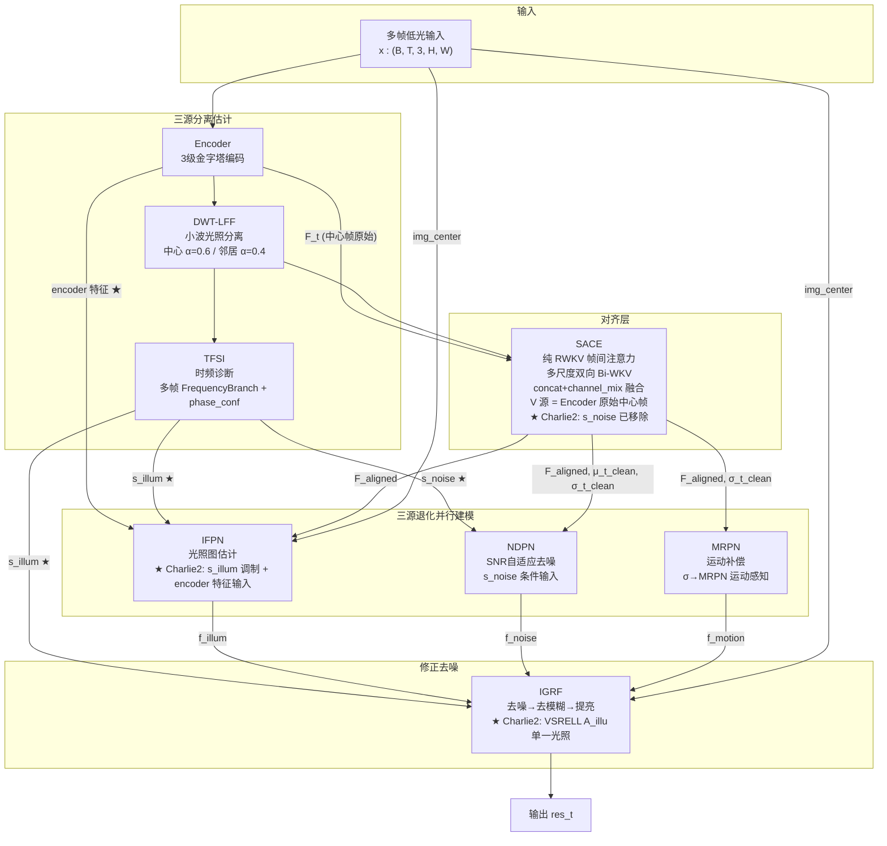
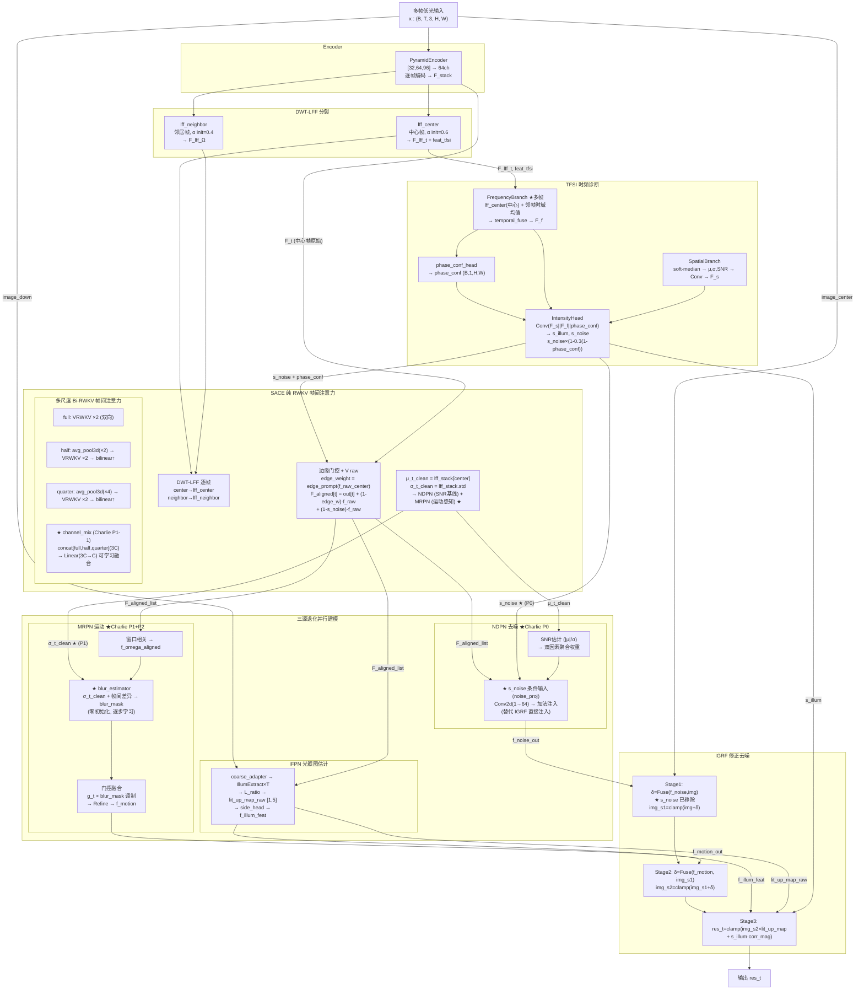

# TFS-Net v6 Charlie2 整体架构图 (2026-06-29, 更新: Charlie2 D1-D4 实施)

## 图一：最简架构（三源分离估计-三源处理-修正去噪）



### 框架要点

- **三源分离估计**：DWT-LFF + TFSI 联合诊断光照(s_illum)和噪声(s_noise)；SACE 通过帧间方差(σ_t_clean)隐式感知运动
- **TFSI ↔ SACE 关系**：TFSI 的 FrequencyBranch 使用多帧邻居融合（Charlie P0-1）；SACE 使用 DWT-LFF 双实例（中心 α=0.6 / 邻居 α=0.4）做对齐前归一化
- **三源并行处理**：IFPN/NDPN/MRPN 三个分支从 SACE 对齐特征各自估计修复方案
- **SACE 纯 RWKV 注意力**：多尺度双向 Bi-WKV（full/half/quarter），concat+channel_mix 可学习融合（Charlie P1-1）

### Charlie 数据流改动（vs Bravo）

| 改动 | 优先级 | 说明 |
|------|--------|------|
| **s_noise → NDNP (+ noise_proj)** | P0 | s_noise 从 IGRF Stage1 移除, 注入 NDPN 作为条件输入 (Conv2d 1→64, 零初始化) |
| **σ_t_clean → MRPN (+ blur_estimator)** | P1 | σ_t_clean 从 NDPN 独占到 MRPN 共享, 用于 blur_mask 运动感知 |
| **sigma_sace 调制 s_noise** | P2 | 高帧间方差(运动) → sigmoid(-σ×2) 降低 s_noise 置信度 |
| **blur_mask 门控 MRPN** | P2 | σ_t_clean + 帧间差异 → blur_estimator → 模糊区偏向邻帧补偿 |

---

## 图二：带细节架构



### Charlie 数据流总览 (实施后)

```
TFSI → s_illum ──────────────────────────────────→ IGRF Stage3 (保留)
TFSI → s_noise ─┬─ (1-s_noise)·f_raw ──→ SACE V 残差    (保留)
                ├─ noise_proj (★P0) ──→ NDPN 条件输入  (新增)
                └─ 不进入 IGRF                          (P0: 移除)

SACE → σ_t_clean ─┬─ NDPN SNR 估计 (|μ|/σ)              (保留)
                   └─ blur_estimator (★P1) → MRPN        (新增)

SACE → sigma_sace → sigmoid(-σ×2) → s_noise 调制 (★P2)  (新增)
```

### Charlie vs Bravo 核心差异

| 维度 | Bravo | Charlie (实施后) |
|------|-------|-----------------|
| **FrequencyBranch** | 仅中心帧 LFF | ★ 多帧 temporal_fuse |
| **多尺度融合** | /3 等权平均 | ★ concat+channel_mix |
| **σ_t_clean 路由** | → NDPN only | → NDPN + ★MRPN (blur_mask) |
| **s_noise → IGRF** | ✓ Stage1 直接注入 | ★ 移除, 仅 NDPN 接收 |
| **s_noise 调制** | phase_conf only | ★ + sigma_sace 调制 (P2) |
| **MRPN 设计** | 简单 gate+ResBlock | ★ + blur_estimator (σ感知) |
