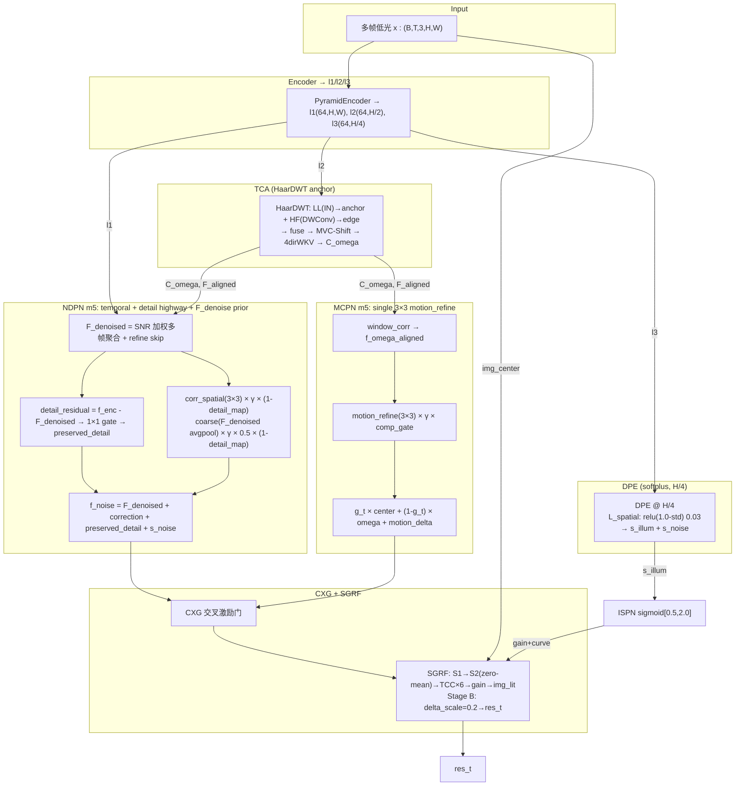

# TFS-Net v6 Delta Flight10 Mark5 整体架构图 (2026-07-28, current)

## 图一：简化架构 (NDPN detail_residual highway + F_denoised prior)



## NDPN m5 详细数据流

```
f_enc (B,64,H,W)
  │
  ├─→ SNR weighted multi-frame aggregation → F_denoised
  │     → + refine(F_denoised) skip connect (P2 fix)
  │
  ├─→ detail_map: |∇F_denoised| → detail_proj → (B,1,H,W) ∈ [0,1]
  │     P1 fix: F_denoised is temporal-filtered, noise-free
  │
  ├─→ detail_residual = f_enc - F_denoised  (what temporal agg removed?)
  │     → detail_gate_1x1(detail_residual) → sigmoid gate
  │     → preserved_detail = detail_residual × gate × detail_map
  │     P0 fix: true highway — only preserve details that differ from smoothed F_denoised
  │
  ├─→ corr_spatial([f_enc, F_denoised, detail_map], 3×3)  (spatial correction)
  │     × γ(max=0.1, P2: relaxed from 0.03) × (1-detail_map)
  │
  ├─→ coarse_prior(F_denoised avgpool→upsample→conv, 3×3)
  │     × γ × 0.5 × (1-detail_map)
  │     P1 fix: F_denoised avgpool replaces l2_lat, properly gated
  │
  └─→ f_noise = F_denoised + corr_spatial + preserved_detail + coarse_prior + s_noise
```

## m4 → m5 修复对照

| # | 问题 (plan) | m4 | **m5** |
|:--:|------|-----|------|
| P0 | NDPN 1×1 与 3×3 同目标冗余 | corr_spatial + corr_pointwise | **detail_residual = f_enc - F_denoised → gate** |
| P0 | MCPN 1×1 对运动无意义 | motion_refine 3×3 + 1×1 | **回退单 3×3** |
| P1 | coarse l2 含噪且无门控 | l2_lat → coarse_proj | **F_denoised avgpool → coarse_prior, +detail_map** |
| P1 | detail_map 被噪声污染 | image_center gradient | **F_denoised gradient** |
| P2 | gamma 0.03 压制三路 | clamp 0.03 | **clamp 0.1** |
| P2 | refine 无 skip | F_denoised = refine(x) | **F_denoised = x + refine(x)** |

## 版本演进

| 版本 | NDPN 核心 | ep40 PSNR |
|------|----------|:--:|
| F10m1 | f_enc - noise_feat × strength (bug: softplus δ) | 17.35 |
| F10m2 | 同上 + bug fixed | 17.60 |
| F10m3 | F_denoised + detail-gated correction | **18.27** |
| F10m4 | m3 + 1×1 bypass + l2 coarse | 设计缺陷 |
| **F10m5** | **m3 + detail_residual highway + F_denoised prior + γ→0.1** | **训练中** |
