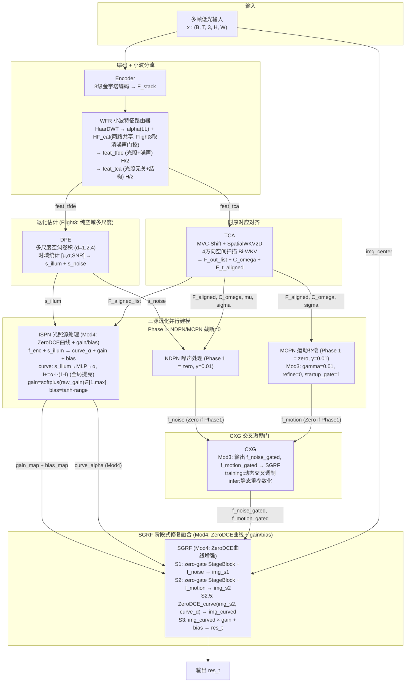
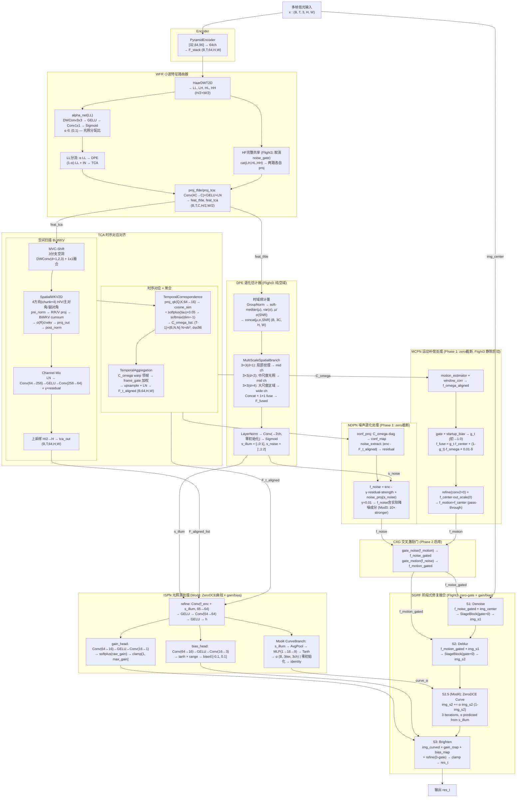

# TFS-Net v6 Delta Flight3 Mod4 整体架构图 (2026-07-09)

## 图一：最简架构 (含 Flight3 Phase-Dependent + 三部保险)



### 框架要点

- **WFR 子带分流 (Flight3: 取消噪声门控)**：HaarDWT 在子带级分离 LL→光照/噪声 (DPE), HF→结构 (TCA)。alpha_net(LL) 可学习 α ∈ (0,1) 分配 LL，受 `(ᾱ-0.7)²` 弱正则（允许 DPE 获取更多 LL）。HF 两路共享，各自 proj 层独立学习。
- **DPE (Flight3 简化)**：移除 FrequencyBranch/LFF/phase_conf，用多尺度空洞卷积 (d=1,2,4) 提取时域统计量 [μ,σ,SNR] 的空域特征。梯度路径从 `feats→LFF→DWT→phase→s_noise` 简化为 `feats→统计量→Conv→head`。
- **ISPN (Mod4: ZeroDCE曲线增强)**：新增 CurveBranch——s_illum → AvgPool → MLP → Tanh → per-image α (3 iter × 3 RGB = 9 DOF)。在 SGRF S2→S3 之间施加 ZeroDCE 曲线 I_{n+1}=I_n+α·I_n·(1-I_n)。零初始化 → Phase 1 为 identity，符合 V11"全局曲线+空间残差"分解（仅 9 参数，天然防过拟合）。gain_map/bias_map 保留做空间精调。
- **TCA 空间扫描**：输入 WFR 的 H/2 特征。MVC-Shift(3 dilated DWConv) → 4方向 Bi-WKV → Channel Mix → H 上采样。C_omega 行 softmax 归一化，L_diag_prior Phase 1 自监督 (Phase 2 取消)。
- **Mod3 γ=0.01**：NDPN 和 MCPN 的 γ 从 Flight3 的 0.001 提升到 0.01——Phase 1.5/2 允许 10× 更强的梯度流过噪声/运动分支。配合 CXG 路由修复 (SGRF 接收 CXG 门控特征)，gamma 直接影响最终输出。

### Flight3 多阶段训练策略

| 阶段 | Epoch | lr | NDPN/MCPN | SGRF gate | 损失项 |
|------|-------|-----|-----------|-----------|--------|
| Phase 1 Warmup | 0-4 | 8e-6→8e-4 | zero | gate=0 | pix+ssim+illum+gain_sup+wfr_reg+ifpn(align+diag) |
| Phase 1 Main | 5-9 | 6e-4 | zero (γ=0.01) | gate=0 | 同上 |
| Phase 1.5 | 10-29 | 6e-4→4e-4 | 线性 0→100% | 渐进学习 | 同上 |
| Phase 2 | 30-89 | 4e-4→0.16e-4 | 100%+CXG | 已学习 | +perceptual(SSIM→S1,VGG→S2)+freq+inter (diag_prior取消) |

---

## 图二：带细节架构



### TCA 空间扫描详解

```
feat_tca (B,T,C,H/2,W/2) from WFR — 已是半分辨率, 无需再降采样
  │
  ├─ [MVC-Shift] 3分支空洞DWConv(d=1,2,3) + 1x1混频 → x_shifted
  │
  ├─ [SpatialWKV2D] 4方向 Bi-WKV
  │     ├─ Split C→4 heads × C/4
  │     ├─ pre_norm (LayerNorm) — 稳定 R/K/V 投影输入
  │     ├─ Head0/H1/H2/H3: 水平/垂直/主对角/副对角扫描
  │     ├─ 每方向独立 BiWKV (chunk-wise cumsum=256, e^w<1 强制衰减)
  │     └─ Concat 4 heads → σ(R)⊙wkv → proj_out → post_norm
  │
  ├─ [Channel Mix] LN → Conv(C→4C) → GELU → Conv(4C→C) → + x * gamma
  │
  ├─ [Upsample] H/2 → H×W → tca_out (B,T,C,H,W)
  │
  ├─ [TemporalCorrespondence]
  │     proj_qk (C→C/4) → cosine_sim → ÷ softplus(tau)+0.05 → softmax(dim=-1)
  │     → C_omega_list: [(B, ds², ds²) × (T-1)], ds=min(H,W)//4 capped≤96
  │
  └─ [TemporalAggregation]
        C_omega × neighbor_ds → warp → frame_gate → softmax加权
        → upsample + residual + LayerNorm → F_t_aligned (B,C,H,W)
```

### Flight3 三部保险 (零扰动启动)

```
Phase 1 → Phase 1.5 → Phase 2 过渡

NDPN:   f_noise  = f_enc - 0.01·noise·strength + noise_proj(s_noise)
          γ=0.01 → CXG-gated output → SGRF (Mod3: CXG路由修复)
          noise_proj 零初始化 → 第二项 = 0

MCPN:   g_t = sigmoid(raw_gate + startup_gate=1) → ≈0.73
          f_fuse = g_t·f_center + (1-g_t)·f_omega + δ·0.01
          refine(conv2=0, out_scale=0) → f_motion ≈ f_center

SGRF:   StageBlock gate = 0 → delta = Conv(x)*0 = 0 → img unchanged
        Mod4: curve_α=0 (零初始化) → curve=identity → 无扰动
                ↓
           四重零保证: 分支零 × gate零 × unlock零 × curve零
                ↓
           Phase 2 启动时输出 ≡ Phase 1 输出
```

### Flight3 损失函数架构

```
                    Phase 1 Warmup (0-4)         Phase 1 Main (5-9)
                    ─────────────────────        ─────────────────────
res_t    ←→ GT  ─→  pix (PECharbonnier)          pix
                    ssim (1-SSIM)                 ssim
gain_map ← GT/I̅ ─→  gain_sup (L1, 0.5× 固定权重)   gain_sup
s_illum          ─→  illum_smooth (edge-TV)       illum_smooth
WFR α            ─→  wfr_reg (0.001固定)          wfr_reg
C_omega          ─→                               align_warp (L1 warp一致性)
                                                  diag_prior (-log(diag)自监督)
NDPN/MCPN         →  零截断 (不参与训练)
CXG               →  bypass (不参与训练)
SGRF gate         →  零 (四重保险: 分支零 × gate零 × unlock零 × curve零)

                    Phase 1.5 (10-29)             Phase 2 (30-89)
                    ─────────────────────        ────────────────────
                    损失同上, NDPN/MCPN           img_s1 ←→ GT → ssim_s1
                    线性unlock_ratio              img_s2 ←→ GT → perc_s2 (VGG)
                    SGRF gate 渐进学习             img_s2×gain ← GT → inter
                    CXG: ratio>0.3启用            res_t ←→ GT → freq (FFT L1)
                                                  diag_prior Phase 2 取消
                            all via Kendall UW (learnable log_vars)
```

### 数值稳定性保证

| 组件 | 措施 |
|------|------|
| **BiWKV** | `w = -F.softplus(spatial_decay)` → e^w < 1 恒衰减 |
| **BiWKV** | chunk-wise cumsum (CHUNK=256), `k.clamp(-8,8)`, `v.clamp(-8,8)` |
| **SpatialWKV2D** | `pre_norm` LayerNorm 在 R/K/V 投影前, R/K/V RWKV-7 小初始化 |
| **SWD** | proj_tfde/proj_tca 后 LayerNorm → IntensityHead norm≈1 |
| **SWD** | alpha_net: sigmoid初始≈0.6 (bias≈0.4) → 偏TFDE但不极端 |
| **Tau** | `F.softplus(tau_raw) + 0.05` → 下界 0.05 防除零 |
| **C_omega** | ds capped ≤ 96 → N≤9216 → C_omega≤340MB, 防OOM |
| **diag_prior** | `C_omega.diag().clamp(min=1e-6)` → -log防数值爆炸 |
| **gain_map** | `softplus(raw_gain).clamp(1.0, max_gain)` → 物理合理范围 |
| **bias_map** | `tanh(·)·range` → 有界输出 |

### Flight3 vs Mark3/Mark1 核心差异

| 维度 | Mark1 | Mark3 | **Flight3** |
|------|-------|-------|-----------|
| **TFDE** | Spatial+Freq+LFF | 同Mark1 | **纯空域多尺度空洞卷积** |
| **ISPN** | 多帧cosine attention | 同Mark1 | **gain/bias Retinex 头** |
| **SGRF Stage3** | lit_up_map×(1+A_illu) | 同Mark1 | **img×gain+bias** |
| **StageBlock** | 标准ResBlock | 同Mark1 | **zero-gate 零初始化** |
| **MCPN** | 随机初始化 | startup_gate=1 | **gamma=0.01 + refine=0** |
| **NDPN** | gamma=0 | 同 | **gamma=0.01 (10x 梯度)** |
| **L_diag_prior** | Phase 1+2 | Phase 1+2 | **Phase 1 only (P2取消)** |
| **L_wfr_reg** | — | (ᾱ-0.5)² | **(ᾱ-0.7)²** |
| **L_gamma_reg** | — | — | **relu(0.005−|γ|) 防坍缩 (Mod3)** |
| **CXG routing** | output unused | output unused | **Mod3: CXG→SGRF (不再pass-through)** |
| **Phase 2 启动** | 剧烈扰动 | PSNR 18→8.7 暴跌 | **三重保险 (无扰动)** |
| **Phase 1.5** | 5 epoch (20-25) | 同 | **20 epoch (10-30)** |
| **参数** | 1.69M | 1.69M | **1.45M** |
| **DPE head** | — | 直接Sigmoid→饱和 | **LayerNorm+零初始化** |
| **ISPN gain** | — | exp→梯度异常 | **softplus+动态max_gain** |
| **WFR HF** | — | noise_gate 误分流 | **共享HF, proj隐式分化** |
| **CurveBranch** | — | — | **Mod4: s_illum→α, ZeroDCE曲线粗提亮 (9 DOF)** |
