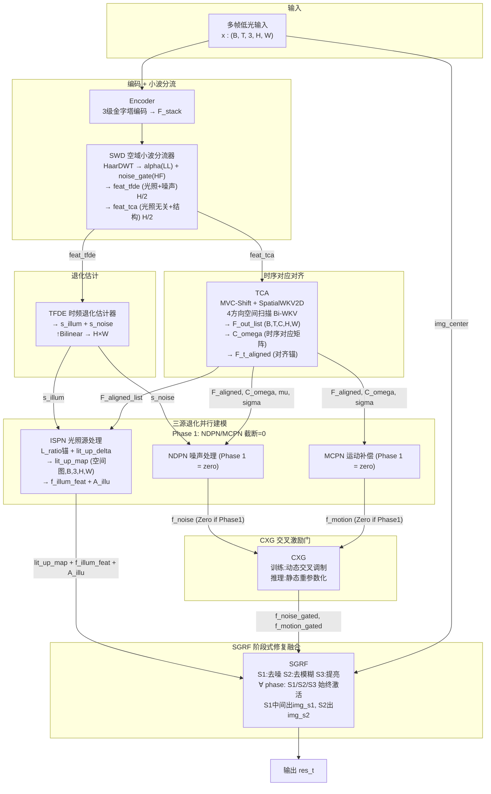
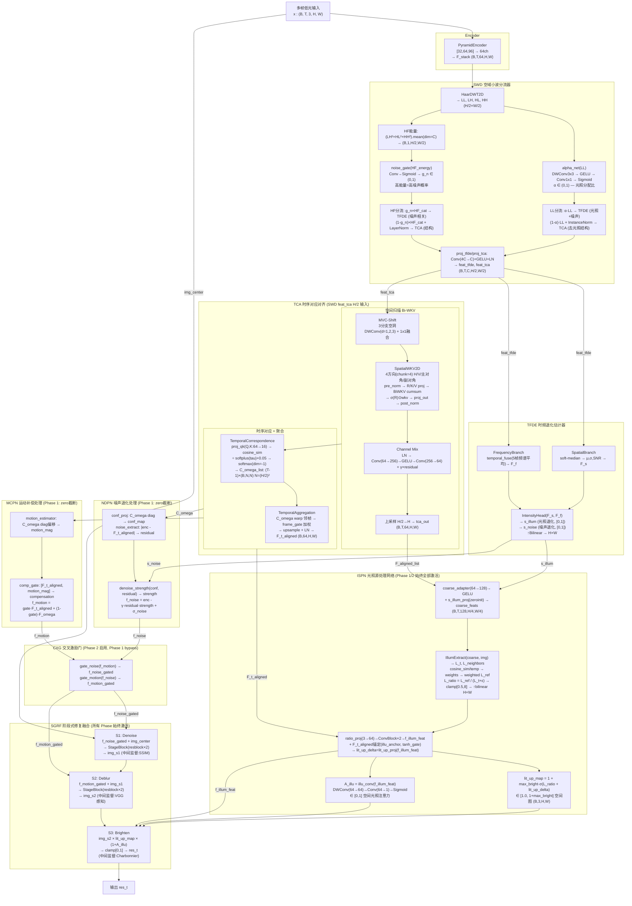

# TFS-Net v6 Delta Mark3 整体架构图 (2026-07-04)

## 图一：最简架构 (含 Mark3 Phase-Dependent)



### 框架要点

- **SWD 子带分流**：HaarDWT 在子带级分离 LL→光照/噪声 (TFDE), HF→结构 (TCA)。alpha_net(LL) 可学习 α ∈ (0,1) 分配 LL 子带, noise_gate(HF_energy) 门控 HF 子带。输出 LayerNorm, TFDE 工作在正常 norm 范围。
- **TCA 空间扫描**：输入 SWD 的 H/2 特征, 无需内部再降采样。MVC-Shift(3 dilated DWConv) → 4方向 Bi-WKV → Channel Mix → H 上采样。
- **C_omega 时序对应**：中心帧与邻帧 cosine similarity 矩阵, softmax 归一化。L_diag_prior 自监督鼓励对角→1 (静止区域 identity 对应)。
- **Mark3 Phase-Dependent Forward**：Phase 1 (0-19): NDPN/MCPN 输出截断为零, CXG bypass, 仅 ISPN+SGRF 激活。Phase 1.5 (20-24): 线性 unlock_ratio。Phase 2 (25-49): 全网络。

### Mark3 多阶段训练策略

| 阶段 | Epoch | lr | NDPN/MCPN | 损失项 |
|------|-------|-----|-----------|--------|
| Phase 1 Warmup | 0-4 | 8e-6→8e-4 | zero | pix+ssim+illum+lit_up_sup+swd_reg+ifpn(align+diag) |
| Phase 1 Main | 5-19 | 6e-4 | zero | 同上 |
| Phase 1.5 | 20-24 | 6e-4→4e-4 | 线性 0→100% | 同上 |
| Phase 2 | 25-49 | 4e-4→1e-4 | 100%+CXG | +perceptual_decoupling(SSIM→S1,VGG→S2)+freq+inter |

---

## 图二：带细节架构



### TCA 空间扫描详解

```
feat_tca (B,T,C,H/2,W/2) from SWD — 已是半分辨率, 无需再降采样
  │
  ├─ [MVC-Shift] 3分支空洞DWConv(d=1,2,3) + 1x1混频 → x_shifted
  │
  ├─ [SpatialWKV2D] 4方向 Bi-WKV
  │     ├─ Split C→4 heads × C/4
  │     ├─ pre_norm (LayerNorm) — 稳定 R/K/V 投影输入
  │     ├─ Head0/H1/H2/H3: 水平/垂直/主对角/副对角扫描
  │     ├─ 每方向独立 BiWKV (chunk-wise cumsum=256, ew<1 强制衰减)
  │     └─ Concat 4 heads → σ(R)⊙wkv → proj_out → post_norm
  │
  ├─ [Channel Mix] LN → Conv(C→4C) → GELU → Conv(4C→C) → + x * gamma
  │
  ├─ [Upsample] H/2 → H×W → tca_out (B,T,C,H,W)
  │
  ├─ [TemporalCorrespondence]
  │     proj_qk (C→C/4) → cosine_sim → ÷ softplus(tau)+0.05 → softmax(dim=-1)
  │     → C_omega_list: [(B, (H/2)², (H/2)²) × (T-1)]
  │
  └─ [TemporalAggregation]
        C_omega × neighbor_ds → warp → frame_gate → softmax加权
        → upsample + residual + LayerNorm → F_t_aligned (B,C,H,W)
```

### Mark3 损失函数架构

```
                    Phase 1 Warmup (0-4)         Phase 1 Main (5-19)
                    ─────────────────────        ─────────────────────
res_t    ←→ GT  ─→  pix (PECharbonnier)          pix
                    ssim (1-SSIM)                 ssim
lit_up_map ← GT/I̅ ─→ lit_up_sup (L1, 0.02×illum) lit_up_sup
s_illum          ─→  illum_smooth (edge-TV)       illum_smooth
SWD α            ─→  swd_reg (0.001固定)          swd_reg
C_omega          ─→                               align_warp (L1 warp一致性)
                                                  diag_prior (-log(diag)自监督)
NDPN/MCPN         →  零截断 (不参与训练)
CXG               →  bypass (不参与训练)

                    Phase 1.5 (20-24)             Phase 2 (25-49)
                    ─────────────────────        ────────────────────
                    损失同上, NDPN/MCPN           img_s1 ←→ GT → ssim_s1
                    线性unlock_ratio              img_s2 ←→ GT → perc_s2 (VGG)
                    CXG: ratio>0.3启用            img_s2·lit_up ← GT → pix_s3 (Charb)
                                                  ifpn_side ← GT↓ → ifpn_sup
                                                  res_t ←→ GT → freq (FFT L1)
                            all via Kendall UW (learnable log_vars)
```

### 数值稳定性保证

| 组件 | 措施 |
|------|------|
| **BiWKV** | `w = -F.softplus(spatial_decay)` → e^w < 1 恒衰减 |
| **BiWKV** | chunk-wise cumsum (CHUNK=256), `k.clamp(-8,8)`, `v.clamp(-8,8)` |
| **SpatialWKV2D** | `pre_norm` LayerNorm 在 R/K/V 投影前 |
| **SpatialWKV2D** | R/K/V RWKV-7 小初始化 `±0.05~0.5/√C` |
| **SWD** | proj_tfde/proj_tca 后 LayerNorm → IntensityHead norm≈1 |
| **SWD** | alpha_net: sigmoid初始≈0.6 (bias≈0.4) → 偏TFDE但不极端 |
| **Tau** | `F.softplus(tau_raw) + 0.05` → 下界 0.05 防除零 |
| **lit_up_map** | max_bright clamp → [1.0, 1+max_bright] ∈ [1.0, 5.0] 物理合理 |
| **diag_prior** | `C_omega.diag().clamp(min=1e-6)` → -log防数值爆炸 |

### Mark3 vs Delta/Mark1 核心差异

| 维度 | Delta | Mark1 | **Mark3** |
|------|-------|-------|-----------|
| **Encoder→下游** | 直连 TFSI/SACE | SWD 子带分流 | 同 Mark1 |
| **训练策略** | 单阶段 | 单阶段 | **4阶段渐进** |
| **NDPN/MCPN** | 始终激活 | 始终激活 | **Phase 1 截断=0** |
| **lit_up_map** | 无 | 空间图但loss池化 | **空间图+空间L1监督** |
| **diag_prior** | 无 | 无 | **C_omega对角-log先验** |
| **感知解耦** | 统一输出 | 统一输出 | **SSIM→S1, VGG→S2, Charb→S3** |
| **Kendall UW** | 无 | Mark2加入 | 同Mark2 (7个log_vars) |
| **命名统一** | 旧(TFSI等) | ✓ 新命名 | ✓ 新命名 |
