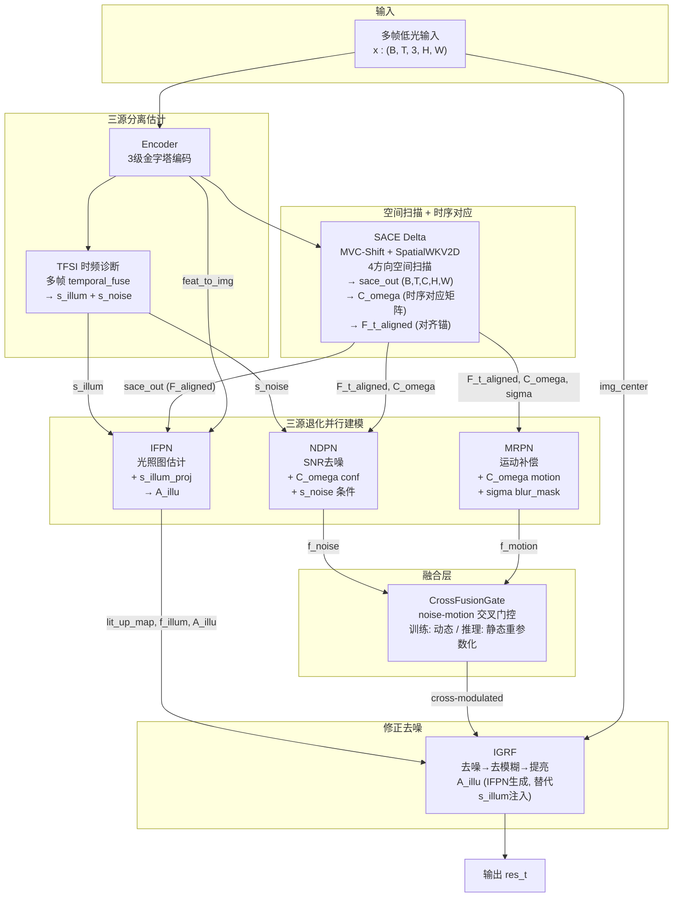
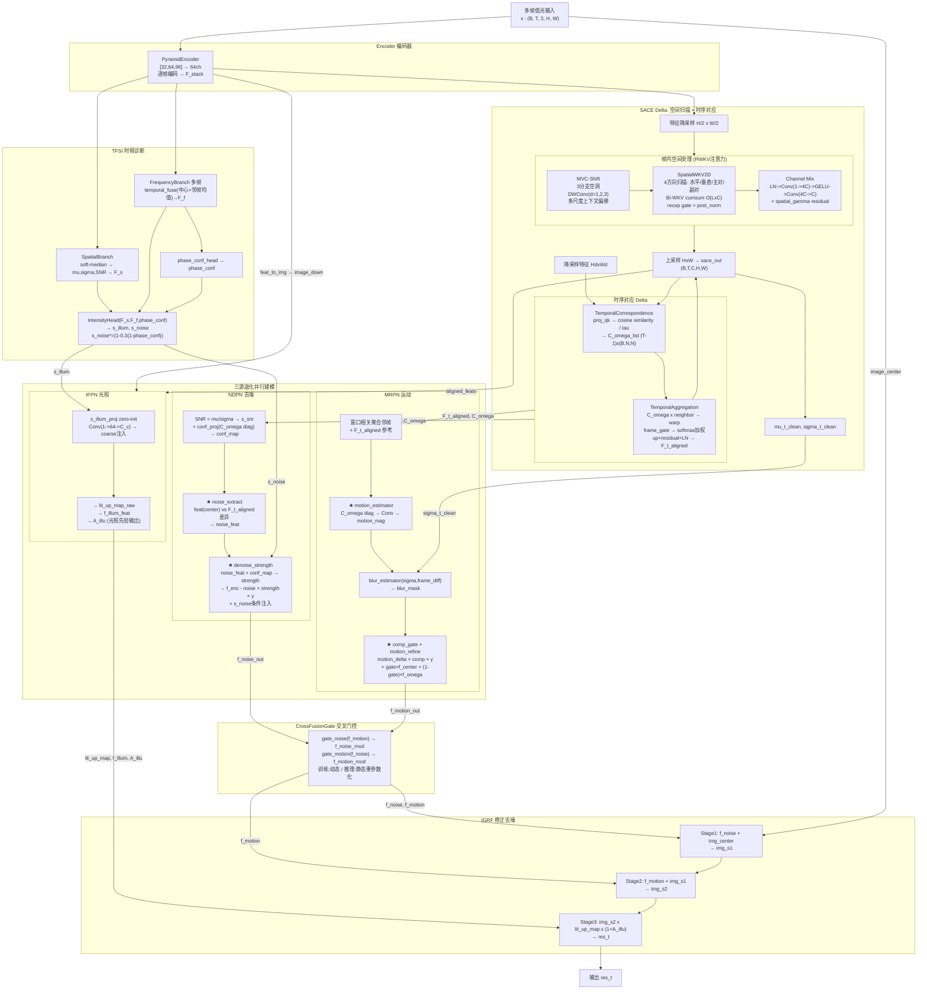

# TFS-Net v6 Delta 整体架构图

## 图一：最简架构 (三源分离估计→三源退化并行建模→修正去噪)



### 框架要点

- **三源分离估计**：Encoder → TFSI (s_illum/s_noise)；SACE 统计量 (σ_t_clean)
- **TFSI ↔ SACE 关系**：TFSI 进行时频域诊断 (temporal_fuse + FFT)，SACE 进行空域扫描 (MVC-Shift + 4方向 WKV)，两者平行独立，在 Encoder 输出处分叉。s_noise 仅注入 NDPN，不再传入 IGRF
- **SACE 内部**：MVC-Shift(多尺度空洞DWConv) → SpatialWKV2D(4方向空间扫描) → Channel Mix → TemporalCorrespondence(时序对应矩阵) → TemporalAggregation(时序对齐聚合)
- **C_omega_list**：Delta 核心创新 — 中心帧与邻帧的空间 cosine similarity 矩阵，同时注入 NDPN(conf_map) 和 MRPN(motion_mag) 作为置信度参考
- **A_illu**：s_illum 经 IFPN s_illum_proj (零初始化) → 最终 A_illu 传入 IGRF，替代旧的 s_illum 直接注入

---

## 图二：带细节架构



### SACE 纯 RWKV 空间扫描详解 (Delta)

```
feats (B,T,C,H,W) from Encoder (no DWT-LFF!)
  │
  ├─ [Downsample] H/2 × W/2 → feats_ds (B,T,C,Hd,Wd)
  │
  ├─ [MVC-Shift] 逐帧处理
  │     3分支空洞DWConv(d=1,2,3) + 1x1混频 → x_shifted
  │
  ├─ [SpatialWKV2D] 4方向空间扫描
  │     ├─ Split C→4 heads × C/4
  │     ├─ Head0: horizontal scan (H×W → L sequence)
  │     ├─ Head1: vertical scan (W×H → L sequence)
  │     ├─ Head2: main-diagonal scan
  │     ├─ Head3: anti-diagonal scan
  │     ├─ Per-direction: Bi-WKV cumsum O(L×C)
  │     │     S_t = cumsum(exp(w)^(t-i)·k_i·v_i)
  │     │     y = (u·k·v + S) / (u·k + cumsum_k + eps)
  │     └─ Concat 4 heads → recep_gate(sigmoid(r)*wkv) → post_norm
  │
  ├─ [Channel Mix] LN → Conv(1→4C) → GELU → Conv(4C→C) → + x * gamma
  │
  ├─ [Upsample] H×W → sace_out (B,T,C,H,W)
  │
  ├─ [TemporalCorrespondence] Delta 新增
  │     proj_qk (C→C/4) → cosine similarity / tau_learnable
  │     → C_omega_list: [(B, ds², ds²) × (T-1)]
  │     注入 NDPN (conf_map) + MRPN (motion_mag)
  │
  └─ [TemporalAggregation] Delta 新增
        C_omega × neighbor_ds → warp per frame
        frame_gate → softmax权重 → 加权聚合
        up + residual + LayerNorm → F_t_aligned (B,C,H,W)
        注入 NDPN/MRPN 作为对齐参考锚
```

### Delta vs Charlie3 核心差异

| 维度 | Charlie3 | Delta |
|------|----------|-------|
| **SACE 输入** | DWT-LFF 归一化特征 | Encoder 原始特征 (无 DWT-LFF) |
| **Token Shift** | Q-Shift (固定位移) | MVC-Shift (可学习空洞DWConv) |
| **扫描方式** | Bi-WKV 帧间 (T维) | **SpatialWKV2D** 帧内4方向 (HW维) |
| **时序对齐** | 隐式 (RWKV mix) | **显式 C_omega + F_t_aligned** |
| **光照注入** | s_illum → IGRF 直接 | **s_illum → IFPN → A_illu → IGRF** |
| **交叉门控** | CrossFusionGate | + deploy 模式 (重参数化) |
| **多尺度融合** | concat+channel_mix | 移除 (MVC-Shift 承担多尺度) |
