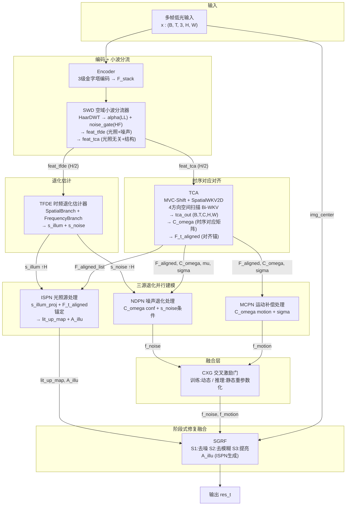
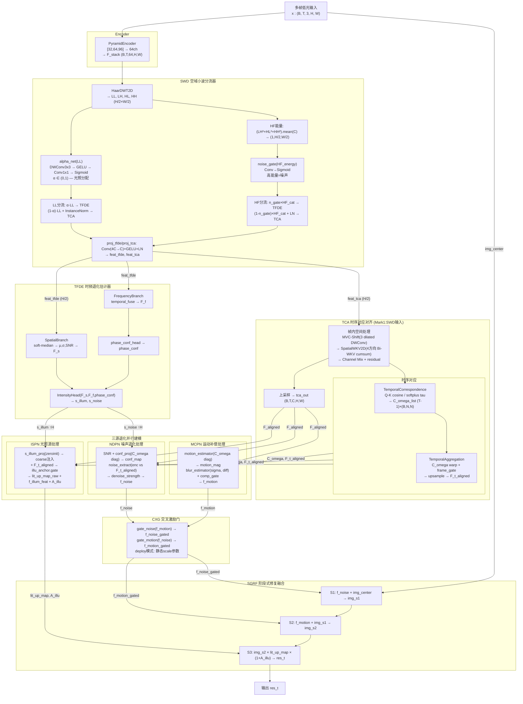

# TFS-Net v6 Delta Mark1 整体架构图 (2026-07-01)

## 图一：最简架构



### 框架要点

- **SWD 小波分流**：Mark1 核心 — Encoder 特征经 HaarDWT 在子带级分离：alpha(LL) 分配光照给 TFDE/TCA，noise_gate(HF) 区分噪声/结构。输出 H/2 分辨率 + LayerNorm，TFDE 工作在正常 norm 范围
- **TFDE ← TCA**：TFDE 接收 feat_tfde（含光照+噪声信号），TCA 接收 feat_tca（光照无关结构），两路真正分流
- **TCA 空间扫描**：输入 SWD 的 H/2 特征，无需内部再降采样。MVC-Shift → 4方向 Bi-WKV → Channel Mix → upsample H
- **C_omega_list**：中心帧与邻帧的 cosine similarity 矩阵，注入 NDPN (conf_map) 和 MCPN (motion_mag) 作为置信度参考
- **命名统一**：TFDE/TCA/ISPN/NDPN/MCPN/CXG/SGRF — 各模块唯一缩写，语义清晰

### Mark1 vs Delta 核心差异

| 维度 | Delta | Mark1 |
|------|-------|-------|
| **Encoder→下游** | Encoder 直连 TFSI/SACE | **SWD 子带分流** → TFDE(光照+噪声) / TCA(结构) |
| **TFDE 输入** | 全分辨率 H×W, norm=60~113 | **H/2 子带, LayerNorm, norm≈1** |
| **TCA 输入** | Encoder 原始特征 → 内部 H/2 降采样 | **SWD feat_tca (H/2 已降采样)** |
| **IDWT** | 是 (DWT-LFF inverse 重建) | **否** (子带级直接输出) |
| **模块命名** | TFSI/SACE/IFPN/MRPN/IGRF | **TFDE/TCA/ISPN/MCPN/SGRF/CXG** |

---

## 图二：带细节架构



### TCA 空间扫描详解 (Mark1)

```
feat_tca (B,T,C,H/2,W/2) from SWD — 已经是半分辨率, 无需再降采样
  │
  ├─ [MVC-Shift] 3分支空洞DWConv(d=1,2,3) + 1x1混频 → x_shifted
  │
  ├─ [SpatialWKV2D] 4方向 Bi-WKV
  │     ├─ Split C→4 heads × C/4
  │     ├─ pre_norm (LayerNorm) — 稳定 R/K/V 投影输入
  │     ├─ Head0/H1/H2/H3: 水平/垂直/主对角/副对角扫描
  │     ├─ 每方向独立 BiWKV (chunk-wise cumsum, ew<1 强制衰减)
  │     └─ Concat 4 heads → σ(R)⊙wkv → proj_out → post_norm
  │
  ├─ [Channel Mix] LN → Conv(C→4C) → GELU → Conv(4C→C) → + x * gamma
  │
  ├─ [Upsample] H/2 → H×W → tca_out (B,T,C,H,W)
  │
  ├─ [TemporalCorrespondence]
  │     proj_qk (C→C/4) → normalize → bmm(Q,K^T)/tau(softplus) → softmax
  │     → C_omega_list: [(B, ds², ds²) × (T-1)]
  │
  └─ [TemporalAggregation]
        C_omega × neighbor_ds → warp → frame_gate → softmax加权
        → upsample + residual + LayerNorm → F_t_aligned (B,C,H,W)
```

### 数值稳定性保证

| 组件 | 措施 |
|------|------|
| **BiWKV** | `w = -F.softplus(spatial_decay)` → ew < 1 恒衰减 |
| **BiWKV** | chunk-wise cumsum (CHUNK=256), `k.clamp(-8,8)` |
| **SpatialWKV2D** | `pre_norm` LayerNorm 在 R/K/V 投影前 |
| **SpatialWKV2D** | R/K/V RWKV-7 小初始化 `±0.05~0.5/√C` |
| **SWD** | proj_tfde/proj_tca 后 LayerNorm → IntensityHead norm≈1 |
| **SWD** | alpha_net 零初始化 → sigmoid(bias=log(0.6/0.4)) → α初始≈0.6 |
| **Tau** | `F.softplus(tau_raw) + 0.05` → 下界 0.05 防除零 |
