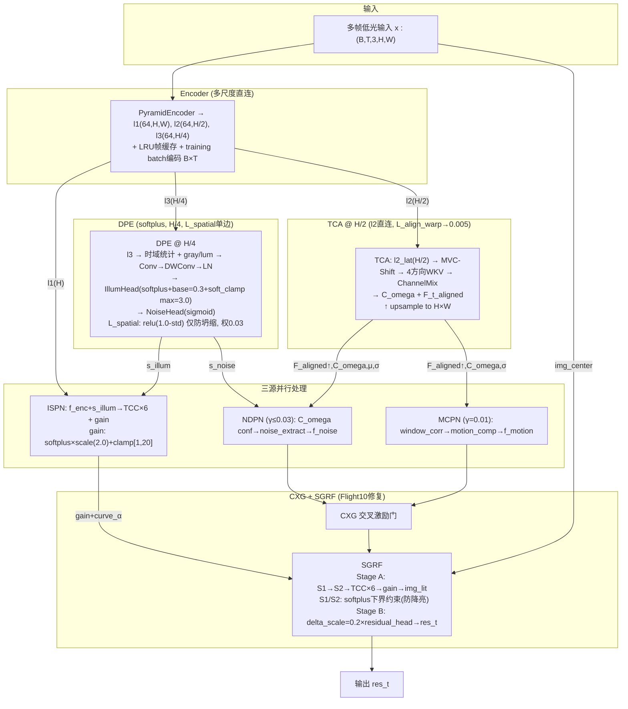

# TFS-Net v6 Delta Flight10 整体架构图 (2026-07-21, current)

## 图一：简化架构 (Flight10)

## Flight10 9项修改清单

| # | 修改 | 文件 | 说明 |
|:--:|------|------|------|
| **4a** | 删除3项死代码 | `losses.py` | L_wfr_reg, L_gamma_reg, L_dpe_prior → 0 |
| **4b** | L_spatial单边化 | `losses.py` | -log(std)→relu(1.0-std), 权0.03 |
| **2** | Stage B delta_scale | `igrf.py` | tanh(β=0)→delta_scale=0.2: 消除梯度死区 |
| **1** | S1/S2亮度下界 | `igrf.py` | softplus(delta-min) 软约束, min=-0.2×img.mean |
| **3** | ISPN gain重写 | `ispn_v2.py` | sigmoid[0.5,2.0]→softplus×scale(2.0)+clamp[1,20] |
| **5** | 感知解耦启用 | `losses.py` | perceptual_decoupling=True: SSIM→img_s1, VGG→res_t, +L_ssim_s2(0.1) |
| **7** | L_gain_range | `losses.py` | gain_mean→clamp(GT/img_s2,1,20), 权0.3 |
| **8** | L_align_warp降权 | `losses.py` | UW→fixed 0.005 (ifpn=5.35 停滞) |
| — | L_brightness | `losses.py` | relu(input*0.8-s1)+relu(s1*0.7-s2), 权0.5 |
| — | 训练优化 | `train.py` | 移除 max_gain 动态调度 |

## 损失函数 (Flight10 Clean)

### Phase 1 (ep 0-10): 8项
| 项 | 权重 | 说明 |
|---|:--:|------|
| L_pix (Charbonnier) | UW | res_t 像素重建 |
| L_ssim | UW | perceptual_decoupling: img_s1 vs GT |
| L_illum_smooth | UW | 边缘感知 TV |
| L_illum_spatial | 0.03 | relu(1.0-std), 单边反坍缩 |
| L_illum_tv | 0.05 | QRetinex 边缘 TV |
| L_gain_sup | 0.5 | gain_map 监督 |
| L_lit | 0.5 | img_lit 监督 |
| L_brightness_preserve | 0.5 | S1/S2 不降亮 |

### Phase 1.5 (ep 11-25): +3项
| 项 | 权重 | 说明 |
|---|:--:|------|
| L_ndpn_aux | 0.2 | SSIM(img_s1,GT)→NDPN |
| L_mcpn_aux | 0.1 | L1(img_s2,GT)→MCPN |
| L_residual_reg | 0.05 | |residual| 防过度 |

### Phase 2 (ep 26-80): +6项
| 项 | 权重 | 说明 |
|---|:--:|------|
| L_ssim_s2 | 0.1 | SSIM(img_s2,GT): 无亮度域偏移 |
| L_perc (VGG) | UW | res_t 感知质量 |
| L_freq (FFT) | UW | 纹理 |
| L_inter | UW | S2×gain vs GT |
| L_gain_range | 0.3 | gain→target |
| L_align_warp | 0.005 | C_ω warp 一致性 |

**已删除**: L_wfr_reg, L_gamma_reg, L_dpe_prior, L_diag_prior(P2)
**总计**: 8→12→18 项 (无死代码)

## 多阶段训练 (epochs=80)

| 阶段 | Epoch | lr | NDPN/MCPN | 关键损失 |
|------|-------|-----|-----------|---------|
| Phase 1 Warmup | 0-4 | 8e-6→8e-4 | zero | pix+ssim+illum+L_spatial+L_tv+L_bright+L_lit+gain_sup |
| Phase 1 Main | 5-10 | 6e-4 | zero(γ流过) | 同上 |
| Phase 1.5 | 11-25 | 6e-4→4.4e-4 | 线性0→100% | +L_ndpn+L_mcpn+L_residual_reg |
| Phase 2 | 26-80 | 4e-4→8e-6 | 100%+CXG | +percep+freq+inter+L_ssim_s2+L_gain_range+L_align_warp |

## Flight10 vs F9 vs F7.2 关键差异

| 维度 | Flight7.2 | Flight9 | **Flight10** |
|------|-----------|---------|-----------|
| **WFR** | feat_tfde+tca | 取消 | 取消 |
| **DPE** | sigmoid | softplus+soft_clamp | softplus+soft_clamp |
| **L_spatial** | — | -log(std), 0.1 | **relu(1.0-std), 0.03** |
| **ISPN gain** | sigmoid[0.5,2.0] | sigmoid[0.5,2.0] | **softplus×scale(2)[1,20]** |
| **Stage B** | tanh(β=0) | tanh(β=0) | **delta_scale=0.2** |
| **S1/S2下界** | 无 | 无 | **softplus软约束** |
| **感知解耦** | 未启用 | 未启用 | **True: SSIM→S1+S2, VGG→res_t** |
| **死代码** | 有 | 有 | **L_wfr/L_gamma/L_dpe 删除** |
| **L_align_warp** | UW | UW | **fixed 0.005** |
| **损失项数** | 17 | 17 | **18 (0死)** |
| **ep10 gain** | 1.25 | 1.25 | **2.39** |
