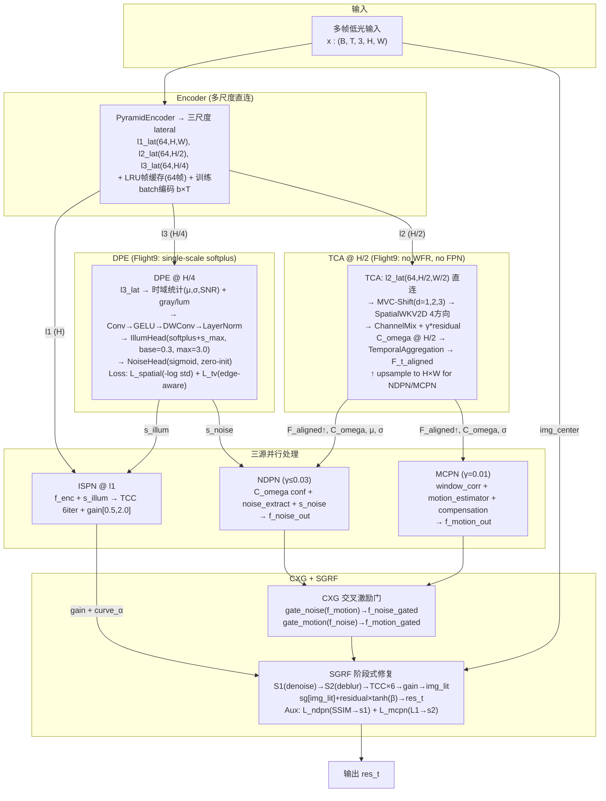
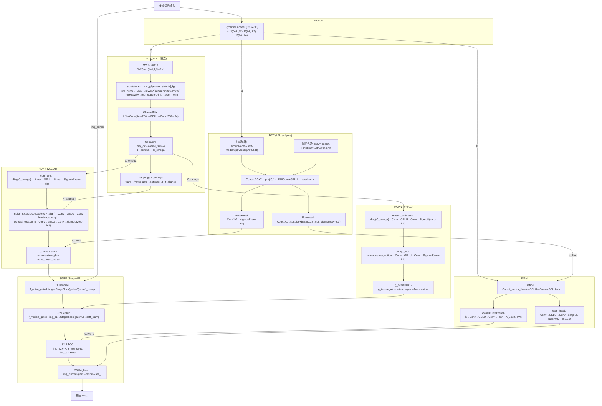

# TFS-Net v6 Delta Flight9 整体架构图 (2026-07-20, current)

## 图一：简化架构 (No WFR, Single-Scale DPE, H/2 TCA)

### Flight9 关键设计点

- **取消 WFR**: Encoder l1/l2/l3 三尺度直连替代小波分流—l3(H/4)天然低频→DPE, l2(H/2)中等分辨率→TCA, l1(H)全分辨率→ISPN/NDPN/MCPN
- **DPE softplus+soft_clamp**: s_illum 不再是 [0,1] 概率而是连续光照强度(base=0.3, asymptotic max=3.0)。softplus 提供全值域非零梯度, soft_clamp x/(1+x/s_max) 物理上界
- **L_illum_spatial**: `-log(std(s_illum) + 1e-6)` — std→0 时损失→∞, 根除常数解(比 sigmoid 的"鼓励极值"梯度方向更合理)
- **TCA H/2**: 128×128 WKV扫描, batch=4 恢复样本多样性(vs Flight8 batch=2), accum=4 保持 eff=16
- **Gamma clamp**: NDPN.gamma = clamp(gamma_raw, max=0.03), 防止 DPE 饱和期间 gn 暴走

### 多阶段训练策略 (epochs=80)

| 阶段 | Epoch | lr | NDPN/MCPN | 损失项 |
|------|-------|-----|-----------|--------|
| Phase 1 Warmup | 0-4 | 8e-6→8e-4 | zero | pix+ssim+illum+gain_sup+L_spatial+L_tv+ifpn |
| Phase 1 Main | 5-10 | 6e-4 | zero (γ=0.01) | 同上 |
| Phase 1.5 | 11-25 | 6e-4→4.4e-4 | 线性 0→100% | +L_ndpn_aux+L_mcpn_aux+L_gamma_reg |
| Phase 2 | 26-80 | 4e-4→1.6e-5 | 100%+CXG | +percep+freq+inter (diag_prior取消) |

---

## 图二：详细架构

### 数值稳定性

| 组件 | 措施 |
|------|------|
| **DPE IllumHead** | softplus (`log(1+e^x)` 梯度>0 全值域) + soft_clamp `x/(1+x/s_max)` asymptotic max |
| **L_illum_spatial** | `-log(std+1e-6)` → 零方差损失∞, 强制空间分布 |
| **L_illum_tv** | `|∇s|·exp(-10|∇I|)` → 边缘处允许突变, 平坦区强制平滑 |
| **BiWKV** | `w = -F.softplus(spatial_decay)` → e^w < 1 恒衰减, chunk-wise cumsum(256) |
| **Tau** | `F.softplus(tau_raw) + 0.05` → 下界 0.05 防除零 |
| **Gamma** | NDPN.gamma = clamp(raw, max=0.03) → 硬上限防暴走 |
| **C_omega** | ds capped ≤ 96 → N≤9216 → C_omega≤340MB |

### Flight9 vs 前代核心差异

| 维度 | Flight7.2 | Flight8 | **Flight9** |
|------|-----------|---------|-----------|
| **WFR** | feat_tfde + feat_tca | feat_tca 残差 | **取消 (Encoder直连)** |
| **DPE激活** | sigmoid | sigmoid | **softplus+soft_clamp** |
| **DPE尺度** | 单尺 multi-dilation | 3-stage cascade | **单尺 H/4** |
| **TCA WKV** | H/2 128×128 | H 256×256 | **H/2 128×128** |
| **TCA输入** | WFR+Enc feats | Internal FPN+WFR | **l2_lat 直连** |
| **batch/accum** | 4/2 | 2/8 | **4/4** |
| **Loss** | UW-only | UW-only | **+L_spatial+L_tv** |
| **Gamma** | 无限制 | 无限制 | **≤0.03** |
| **Epochs** | 85 | 100→ep22终止 | **80** |
