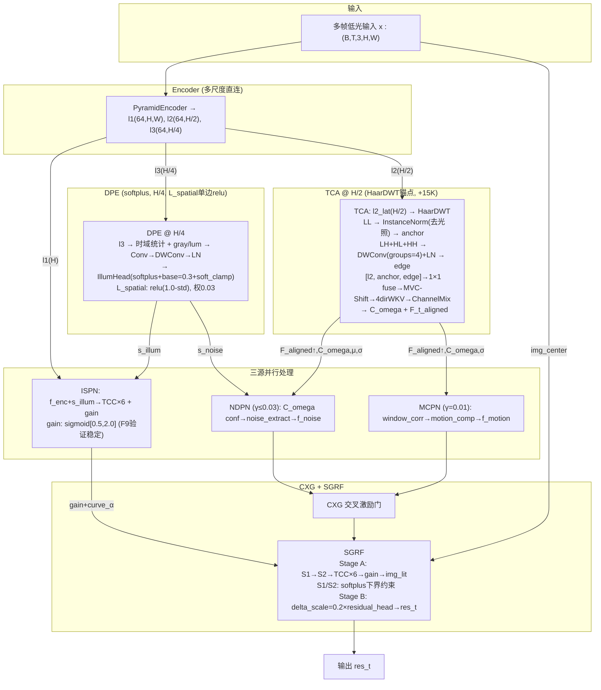

# TFS-Net v6 Delta Flight10 Mark1 整体架构图 (2026-07-22, current)

## 图一：简化架构 (Flight10m1: gan回退 + HaarDWT锚点)



## F10→F10m1 变更清单

| 操作 | 项目 | 文件 | 原因 |
|:--:|------|------|------|
| **回退** | ISPN gain: softplus×scale → sigmoid[0.5,2.0] | `ispn_v2.py` | softplus×scale坍缩到1.0无法自恢复 |
| **回退** | perceptual_decoupling → False | `losses.py`, `train.py` | SSIM(img_s1,GT)亮度项永久0.3占UW权重 |
| **删除** | L_gain_range | `losses.py` | 与gain冲突, target_gain在warmup期剧烈波动 |
| **删除** | L_align_warp | `losses.py` | ifpn=5.35停滞20+epoch,无梯度信号 |
| **新增** | TCA HaarDWT锚点 | `pure_rwkv_sace.py` | LL(IN去光照)+HF(边缘)→闭合WFR差距 |
| **保留** | softplus DPE, L_spatial单边, S1/S2下界, Stage B delta_scale, L_brightness_preserve | — | F10验证有效 |

## TCA HaarDWT 锚点细节

```
l2_lat (B*T, 64, H/2, W/2)
  │
  ├─→ HaarDWT ─────────────────────────────┐
  │     ├─ LL (H/4) → InstanceNorm(affine)  │  ← 去光照偏置，保留结构
  │     │   → 1×1 Conv(64→64) → Upsample    │
  │     │                                    │
  │     └─ LH+HL+HH (H/4)                  │
  │         → cat → DWConv(192→64,k3,g4)    │  ← 分组方向感知边缘
  │         → LayerNorm → Upsample           │
  │                                          │
  └─→ Concat[anchor,edge,l2_lat] ───────────┘
        → 1×1 Conv(192→64) → MVC-Shift → WKV → ChannelMix → ...
```

## 损失函数 (Flight10m1 Clean: 15项)

### Phase 1 (ep 0-10): 7项
| 项 | 权重 | 说明 |
|---|:--:|------|
| L_pix (Charbonnier) | UW | res_t 像素重建 |
| L_ssim | UW | res_t (not img_s1) |
| L_illum_smooth | UW | 边缘感知 TV |
| L_illum_spatial | 0.03 | relu(1.0-std) 单边 |
| L_illum_tv | 0.05 | QRetinex 边缘 TV |
| L_gain_sup | 0.5 | gain_map 监督 |
| L_brightness_preserve | 0.5 | S1/S2 不降亮 |

### Phase 1.5 (ep 11-25): +3项
| 项 | 权重 | 说明 |
|---|:--:|------|
| L_ndpn_aux | 0.2 | SSIM(img_s1,GT)→NDPN |
| L_mcpn_aux | 0.1 | L1(img_s2,GT)→MCPN |
| L_residual_reg | 0.05 | |residual| 防过度 |

### Phase 2 (ep 26-80): +5项
| 项 | 权重 | 说明 |
|---|:--:|------|
| L_lit | 0.5 | img_lit 监督 |
| L_perc (VGG) | UW | res_t 感知质量 |
| L_freq (FFT) | UW | 纹理 |
| L_inter | UW | S2×gain vs GT |
| L_ssim_s2 | 0.1 | SSIM(img_s2,GT) 辅助 |

## 多阶段训练 (epochs=80)

| 阶段 | Epoch | lr | NDPN/MCPN |
|------|-------|-----|-----------|
| P1 Warmup | 0-4 | 8e-6→8e-4 | zero |
| P1 Main | 5-10 | 6e-4 | zero(γ流过) |
| P1.5 | 11-25 | 6e-4→4.4e-4 | 线性0→100% |
| P2 | 26-80 | 4e-4→8e-6 | 100%+CXG |

## F10m1 vs 前代核心差异

| 维度 | F7.2(17.10) | F9(16.33) | F10(15.92) | **F10m1** |
|------|:--:|:--:|:--:|:--:|
| WFR | 25K full | ✗ | ✗ | **15K anchor** |
| DPE | sigmoid | softplus+clamp | softplus+clamp | softplus+clamp |
| L_spatial | — | -log(std) | relu(1.0-std) | relu(1.0-std) |
| ISPN gain | sigmoid[0.5,2.0] | sigmoid[0.5,2.0] | softplus×scale | **sigmoid[0.5,2.0]** |
| 感知解耦 | ✗ | ✗ | ✓(SSIM→img_s1) | **✗ (回退)** |
| L_align_warp | UW | UW | 0.005 | **删除** |
| L_gain_range | ✗ | ✗ | 0.3 | **删除** |
| Stage B | tanh(β=0) | tanh(β=0) | delta_scale=0.2 | delta_scale=0.2 |
| S1/S2下界 | ✗ | ✗ | softplus | softplus |
| 损失项数 | 17 | 17 | 18 | **15** |
