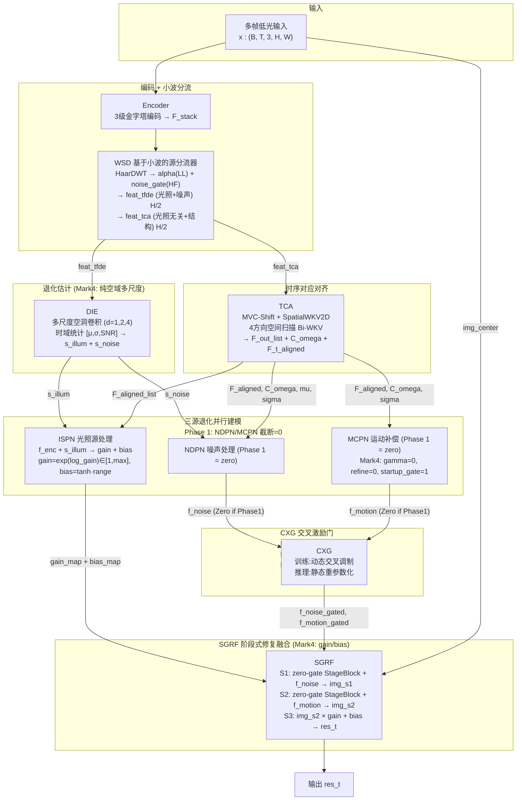
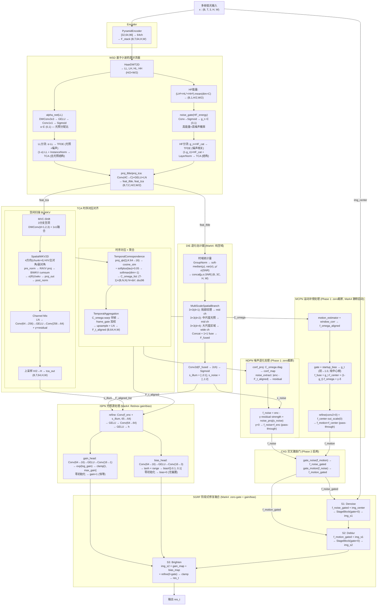

# TFS-Net v6 Delta Mark4 整体架构图 (2026-07-06)

## 图一：最简架构 (含 Mark4 Phase-Dependent + 三部保险)



### 框架要点

- **WSD 子带分流**：HaarDWT 在子带级分离 LL→光照/噪声 (TFDE), HF→结构 (TCA)。alpha_net(LL) 可学习 α ∈ (0,1) 分配 LL 子带, noise_gate(HF_energy) 门控 HF 子带。输出 LayerNorm。
- **DIE (Mark4 简化)**：移除 FrequencyBranch/LFF/phase_conf，用多尺度空洞卷积 (d=1,2,4) 提取时域统计量 [μ,σ,SNR] 的空域特征。梯度路径从 `feats→LFF→DWT→phase→s_noise` 简化为 `feats→统计量→Conv→head`。
- **ISPN (Mark4 简化)**：移除多帧 cosine attention + L_ratio 锚定，直接用 `f_enc + s_illum` 生成 gain_map (乘法提亮) + bias_map (加法修正)。零初始化 → gain≈1, bias≈0 → Phase 1 友好。
- **TCA 空间扫描**：输入 SWD 的 H/2 特征。MVC-Shift(3 dilated DWConv) → 4方向 Bi-WKV → Channel Mix → H 上采样。C_omega 行 softmax 归一化，L_diag_prior 自监督。
- **三部保险 (Mark4)**：Phase 2 启动时 NDPN (gamma=0, noise_proj=0) + MCPN (gamma=0, refine=0, startup_gate=1, out_scale=0) + SGRF StageBlock (gate=0) — 任一层都能独立保证无扰动。

### Mark4 多阶段训练策略

| 阶段 | Epoch | lr | NDPN/MCPN | SGRF gate | 损失项 |
|------|-------|-----|-----------|-----------|--------|
| Phase 1 Warmup | 0-4 | 8e-6→8e-4 | zero | gate=0 | pix+ssim+illum+gain_sup+swd_reg+ifpn(align+diag) |
| Phase 1 Main | 5-19 | 6e-4 | zero | gate=0 | 同上 |
| Phase 1.5 | 20-29 | 6e-4→4e-4 | 线性 0→100% | 渐进学习 | 同上 |
| Phase 2 | 30-49 | 4e-4→1e-4 | 100%+CXG | 已学习 | +perceptual_decoupling(SSIM→S1,VGG→S2)+freq+inter |

---

## 图二：带细节架构



### TCA 空间扫描详解

```
feat_tca (B,T,C,H/2,W/2) from SWD — 已是半分辨率, 无需再降采样
  │
  ├─ [MVC-Shift] 3分支空洞DWConv(d=1,2,3) + 1x1混频 → x_shifted
  │
  ├─ [SpatialWKV2D] 4方向 Bi-WKV
  │     ├─ Split C→4 heads × C/4
  │     ├─ pre_norm (LayerNorm) — 稳定 R/K/V 投影输入
  │     ├─ Head0/H1/H2/H3: 水平/垂直/主对角/副对角扫描
  │     ├─ 每方向独立 BiWKV (chunk-wise cumsum=256, e^w<1 强制衰减)
  │     └─ Concat 4 heads → σ(R)⊙wkv → proj_out → post_norm
  │
  ├─ [Channel Mix] LN → Conv(C→4C) → GELU → Conv(4C→C) → + x * gamma
  │
  ├─ [Upsample] H/2 → H×W → tca_out (B,T,C,H,W)
  │
  ├─ [TemporalCorrespondence]
  │     proj_qk (C→C/4) → cosine_sim → ÷ softplus(tau)+0.05 → softmax(dim=-1)
  │     → C_omega_list: [(B, ds², ds²) × (T-1)], ds=min(H,W)//4 capped≤96
  │
  └─ [TemporalAggregation]
        C_omega × neighbor_ds → warp → frame_gate → softmax加权
        → upsample + residual + LayerNorm → F_t_aligned (B,C,H,W)
```

### Mark4 三部保险 (零扰动启动)

```
Phase 1 → Phase 1.5 → Phase 2 过渡

NDPN:   f_noise  = f_enc - γ·noise·strength + noise_proj(s_noise)
          γ=0 → f_noise ≈ f_enc (pass-through)
          noise_proj 零初始化 → 第二项 = 0

MCPN:   g_t = sigmoid(raw_gate + startup_gate=1) → ≈0.73
          f_fuse = g_t·f_center + (1-g_t)·f_omega + δ·γ(0)
          refine(conv2=0, out_scale=0) → f_motion ≈ f_center

SGRF:   StageBlock gate = 0 → delta = Conv(x)*0 = 0 → img unchanged
                ↓
           三重零保证: 分支零 × gate零 × unlock零
                ↓
           Phase 2 启动时输出 ≡ Phase 1 输出
```

### Mark4 损失函数架构

```
                    Phase 1 Warmup (0-4)         Phase 1 Main (5-19)
                    ─────────────────────        ─────────────────────
res_t    ←→ GT  ─→  pix (PECharbonnier)          pix
                    ssim (1-SSIM)                 ssim
gain_map ← GT/I̅ ─→  gain_sup (L1, 0.02×illum)   gain_sup
s_illum          ─→  illum_smooth (edge-TV)       illum_smooth
SWD α            ─→  swd_reg (0.001固定)          swd_reg
C_omega          ─→                               align_warp (L1 warp一致性)
                                                  diag_prior (-log(diag)自监督)
NDPN/MCPN         →  零截断 (不参与训练)
CXG               →  bypass (不参与训练)
SGRF gate         →  零 (不参与训练, 三重保险)

                    Phase 1.5 (20-29)             Phase 2 (30-49)
                    ─────────────────────        ────────────────────
                    损失同上, NDPN/MCPN           img_s1 ←→ GT → ssim_s1
                    线性unlock_ratio              img_s2 ←→ GT → perc_s2 (VGG)
                    SGRF gate 渐进学习             img_s2×gain ← GT → inter
                    CXG: ratio>0.3启用            res_t ←→ GT → freq (FFT L1)
                            all via Kendall UW (learnable log_vars)
```

### 数值稳定性保证

| 组件 | 措施 |
|------|------|
| **BiWKV** | `w = -F.softplus(spatial_decay)` → e^w < 1 恒衰减 |
| **BiWKV** | chunk-wise cumsum (CHUNK=256), `k.clamp(-8,8)`, `v.clamp(-8,8)` |
| **SpatialWKV2D** | `pre_norm` LayerNorm 在 R/K/V 投影前, R/K/V RWKV-7 小初始化 |
| **SWD** | proj_tfde/proj_tca 后 LayerNorm → IntensityHead norm≈1 |
| **SWD** | alpha_net: sigmoid初始≈0.6 (bias≈0.4) → 偏TFDE但不极端 |
| **Tau** | `F.softplus(tau_raw) + 0.05` → 下界 0.05 防除零 |
| **C_omega** | ds capped ≤ 96 → N≤9216 → C_omega≤340MB, 防OOM |
| **diag_prior** | `C_omega.diag().clamp(min=1e-6)` → -log防数值爆炸 |
| **gain_map** | `exp(log_gain).clamp(1.0, max_gain)` → 物理合理范围 |
| **bias_map** | `tanh(·)·range` → 有界输出 |

### Mark4 vs Mark3/Mark1 核心差异

| 维度 | Mark1 | Mark3 | **Mark4** |
|------|-------|-------|-----------|
| **TFDE** | Spatial+Freq+LFF | 同Mark1 | **纯空域多尺度空洞卷积** |
| **ISPN** | 多帧cosine attention | 同Mark1 | **gain/bias Retinex 头** |
| **SGRF Stage3** | lit_up_map×(1+A_illu) | 同Mark1 | **img×gain+bias** |
| **StageBlock** | 标准ResBlock | 同Mark1 | **zero-gate 零初始化** |
| **MCPN** | 随机初始化 | startup_gate=1 | **gamma=0 + refine=0 + out_scale=0** |
| **Phase 2 启动** | 剧烈扰动 | PSNR 18→8.7 暴跌 | **三重保险 (无扰动)** |
| **Phase 1.5** | 5 epoch (20-25) | 同 | **10 epoch (20-30)** |
| **参数** | 1.69M | 1.69M | **1.45M** |
