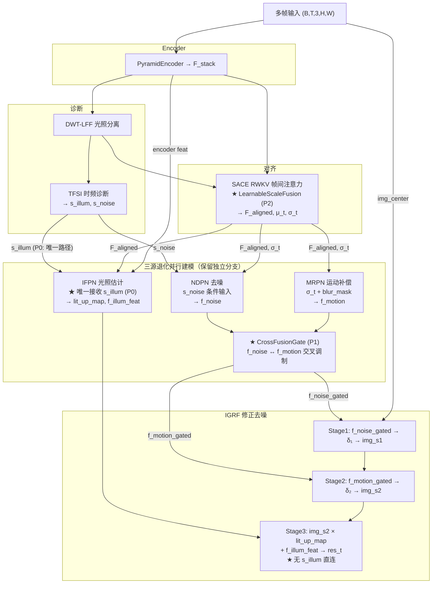

# TFSNet v6 Charlie 训练不稳定性深度分析

## 实行状态 (2026-06-29)

| 步骤 | 简述 | 状态 | 变更文件 |
|------|------|------|----------|
| P0 | s_illum 路径统一到 IFPN (移除 s_illum→IGRF) | ✅ 已完成 | `ifpn.py` L103-112, `igrf.py` L127-141/175-195, `tfs_net.py` L289-295 |
| P1 | CrossFusionGate NDPN/MRPN 交叉门控 | ✅ 已完成 | `tfs_net.py` L40-72 (class) + L149 + L308-309 |
| P2 | LearnableScaleFusion 替换 SACE channel_mix | ✅ 已完成 | `pure_rwkv_sace.py` L27-59 (class) + L92-93 + L178-182 |

参数量: 1.319M (Charlie2 1.260M → +59K)

---

## 核心结论

**SSM（RWKV）不是训练不稳定的主因。真正的根因是：多分支梯度冲突 + 多尺度融合的尺度失衡 + 归一化策略与 IR 任务的系统性失配。**

---

## 一、RWKV 本身不是问题：来自 RWKV-IR 的证据

根据 [RWKV-IR 的消融实验](https://arxiv.org/html/2412.03814v1)，RWKV 基础架构在图像恢复任务中的收敛能力和恢复性能实际上**优于 SwinIR**：

> *"Our RWKV-based baseline outperforms SwinIR by 0.08dB on Urban100 for x4 scale and MambaIR by 0.03dB, demonstrating the image restoration capability and **quick convergence ability** of our RWKV-IR."*

但该论文同时揭示了 RWKV 用于 IR 任务的两个适配问题：

| 问题 | 量化影响 | 你的代码现状 |
|------|---------|-------------|
| Q-Shift 不适合 IR（破坏局部相似性） | -0.87 dB | 你用了自定义 `q_shift_2d`（gamma=0.25），部分缓解 |
| Bi-WKV 方向注意力不均 | -0.75 dB | 你用了 `_bi_wkv_scan` 但非 Cross-Bi-WKV |

RWKV-IR 的解决方案——用 **Depth-wise Conv Shift (DC-Shift)** 替换 Q-Shift、用 **Cross-Bi-WKV** 替换 Bi-WKV——可以作为你的后续优化，但**这不是训练不稳定的根因**。

[Restore-RWKV](https://arxiv.org/html/2407.11087v3) 进一步证实，仅 1.16M 参数的轻量 RWKV 模型即可达到 SOTA，说明 RWKV 框架本身是稳定可训练的。

---

## 二、三大真正根因

### 根因 1：8 项损失的梯度冲突（Gradient Conflict）

你的损失配置：
```
L_total = 1.0·Charbonnier + 0.04·VGG + 0.2·(1-SSIM) 
        + 0.05·L_freq + 0.001·L_illum_smooth + 0.02·L_illum_sup 
        + 0.2·L_inter + 0.1·L_ifpn_sup
```

[GCond (2025)](https://ar5iv.labs.arxiv.org/html/2509.07252) 明确指出：

> *"The problem is exacerbated by the 'tragic triad,' when conflicting gradient directions combine with significant differences in magnitude and high curvature in the optimization landscape... direct gradient averaging often worsens results compared to separate task training."*

> *"This effect is particularly pronounced in **early training stages**, when model parameters have not yet adapted to the multi-objective optimization landscape."*

[TAT (2025)](https://doi.org/10.48550/arxiv.2512.14550) 也证实：

> *"Task interference occurs when conflicting gradient update directions arise across tasks on the same parameter... one-size-fits-all approach often results in suboptimal performance."*

**在你的架构中，冲突尤其严重**：

| 损失项 | 优化方向 | 冲突对象 |
|--------|---------|---------|
| Charbonnier | 像素精确拟合 | VGG（感知空间） |
| SSIM | 结构保持 | L_freq（频域约束） |
| L_illum_smooth | 光照平滑 | 细节保持（Charbonnier） |
| L_ifpn_sup | IFPN 中间输出 | 最终输出损失 |

更关键的是，这些损失**不仅方向冲突，而且幅值差异巨大**。Charbonnier≈0.01量级，VGG≈0.1量级，SSIM≈0.3量级——梯度幅值差可达 30×。

### 根因 2：多尺度融合的特征尺度失衡

[Scale Equalizer 论文 (2025)](https://openreview.net/notes/edits/attachment?id=XAsW7j3gyE&name=pdf) 通过理论证明了一个被普遍忽略的定理：

> **定理 3.2**: *"Bilinear upsampling decreases feature variance, i.e., Var[UP_r(X)] < Var[X] for upsampling ratio r > 1."*

> *"When Var[x1] = 10·Var[x2], we obtain Var[∂y/∂w1] = 10·Var[∂y/∂w2], and thus gradient descent on w2 is on a ten times smaller scale than w1, which slows down the training on w2."*

**你的代码中有至少 4 处存在该问题：**

```python
# tfs_net.py 中的多尺度融合
# 1. conv_up2: PixelShuffle(2) 后与 bilinear 上采样特征 cat
f2_up = self.conv_up2(torch.cat([f4_out, f4_out], dim=1))
f2_up = f2_up + F.interpolate(f2_feat, ...)  # ← bilinear 降低方差

# 2. conv_up4: 两个不同来源的特征 cat
f1_up = self.conv_up4(torch.cat([f1_up_pre, f2_up], dim=1))

# 3. tail: 上采样后特征与原始编码器特征 cat
out = self.tail(torch.cat([f1_up, f1], dim=1))

# 4. PureRWKVSACE: 三尺度 concat
# full + half(avg_pool→bilinear↑) + quarter(avg_pool→bilinear↑)
cat_3 = torch.cat(xs, dim=3)  # 来自不同空间分辨率的特征
```

每处 `F.interpolate` / `nn.PixelShuffle` 后的特征，其方差被系统性压低。当与未经上采样的特征 cat 后送入同一 Conv/Linear 层时，**优化器无法区分这两个方向的梯度尺度差异**，导致一个分支过冲、另一个欠训练。

### 根因 3：LayerNorm 与 IR 任务的本质失配

[i-LN 论文 (2025)](https://arxiv.org/html/2504.06629v2) 揭示了 IR Transformer 中一个极其严重但被忽略的现象：

> *"Feature magnitudes diverge dramatically, reaching scales up to a **million**, while channel-wise feature entropy drops sharply."*

> *"We hypothesize the root cause as the mismatch between IR tasks and constraints raised by LayerNorm: 1) the **per-token operational scheme** disrupts inter-token spatial correlations; 2) **input-blind mapping** towards a unified normalized space disregards unique statistical properties of the input."*

> *"Networks attempting to circumvent the constraints of LayerNorm that do not align with the characteristics of IR tasks... amplifying values of specific channels."*

**你的架构中归一化策略混乱且有害：**

| 位置 | 归一化类型 | 问题 |
|------|-----------|------|
| `blocks.py` LayerNorm2d | per-channel (channel-wise mean/var) | 破坏空间相关性 |
| `cross_rwkv.py` post_norm | `nn.LayerNorm(channels)` — per-token | **最危险**：特征发散 |
| `dwt_lff.py` norm_sace/norm_tfsi | `nn.LayerNorm(in_channels)` | per-token，破坏空间信息 |
| `tfs_net.py` ChannelNorm | channel-wise (类似 InstanceNorm) | 尚可，但与其他混用有问题 |

**最致命的是 `post_norm`**：VRWKVStyleSpatialMix 的输出经过 `self.post_norm(out)` —— 这是标准的 per-token LayerNorm，在 RWKV 输出上**系统性破坏帧间空间相关模式**，迫使网络放大特定通道来"绕过"归一化。

---

## 三、量化对比：你的架构 vs 标准 U-Net

| 对比维度 | 标准 U-Net | TFSNet v6 Charlie | 不稳定风险 |
|---------|-----------|-------------------|-----------|
| 梯度路径复杂度 | 1 条主路径 + skip | 5+ 条并行/串行路径 | ⚠️⚠️⚠️ |
| 损失函数项数 | 1-2 项 | **8 项** + deep_supervision | ⚠️⚠️⚠️ |
| 特征融合次数 | 3-4 级 skip (加法) | 4+ 级 cat + 多尺度 cat | ⚠️⚠️⚠️ |
| 归一化一致性 | 统一 BN 或无 | 混用 4 种归一化 | ⚠️⚠️⚠️ |
| 核心注意力 | Conv / Window Attn | RWKV (SSM) | ⚠️（可修复） |
| 条件分支 | 无 | s_noise→NDPN, σ→MRPN, s_illum→IGRF | ⚠️⚠️ |

[SymUNet (2025)](https://doi.org/10.48550/arxiv.2512.10581) 的核心洞察直接解释了你的困境：

> *"Asymmetric designs dilute [degradation] cues in the heavier decoder... conflicting signals from heterogeneous degradations clash in unaligned feature spaces, leading to **training instabilities** that are mitigated in single-task settings by degradation consistency, but are amplified in all-in-one contexts."*

你的架构虽然不是 "all-in-one"，但 **TFSI/SACE/IFPN/NDPN/MRPN 五个分支处理不同类型的退化信号**（光照/噪声/运动模糊），本质上也是一种多任务架构。

---

## 四、改进方案（按优先级排序）

### P0: 渐进式损失引入（最快见效，无需改代码结构）

参考 [SPGD](https://arxiv.org/html/2507.06656)：

> *"Progressive likelihood warm-up strategy to mitigate gradient conflicts."*

```python
# 训练前 10 epoch：只用主损失
# 10-20 epoch：逐步引入辅助损失
def get_loss_weights(epoch, total_epochs=50):
    warmup = min(epoch / 10, 1.0)
    return {
        'pix': 1.0,                         # 始终开启
        'perc': 0.04 * warmup,              # 渐进引入
        'ssim': 0.2 * warmup,               # 渐进引入
        'freq': 0.05 * warmup,              # 渐进引入
        'illum_smooth': 0.001 * warmup,
        'illum_sup': 0.02 * warmup,
        'inter': 0.2 * warmup ** 2,         # 更慢引入
        'ifpn_sup': 0.1 * warmup ** 2,      # 更慢引入
    }
```

### P1: 归一化统一替换为 i-LN 风格（高优先级）

参考 [i-LN](https://arxiv.org/html/2504.06629v2)：

> *"Normalizes features holistically across the entire spatio-channel dimension, preserving spatial relationships among tokens."*

```python
class iLayerNorm2d(nn.Module):
    """i-LN: holistic normalization (不是 per-token)"""
    def __init__(self, channels):
        super().__init__()
        self.gamma = nn.Parameter(torch.ones(1, channels, 1, 1))
        self.beta = nn.Parameter(torch.zeros(1, channels, 1, 1))
    
    def forward(self, x):
        # 整个 sample 维度归一化，保持空间相关性
        mean = x.mean(dim=(1, 2, 3), keepdim=True)
        std = x.std(dim=(1, 2, 3), keepdim=True) + 1e-6
        # 输入自适应 rescaling
        return (x - mean) / std * self.gamma + self.beta
```

**替换位置（按优先级）：**
1. `cross_rwkv.py` 的 `post_norm` → 改为 holistic norm
2. `dwt_lff.py` 的 `norm_sace` / `norm_tfsi`
3. `blocks.py` 的 `LayerNorm2d`

### P2: 多尺度融合前注入 Scale Equalizer（中等优先级）

参考 [Scale Equalizer](https://openreview.net/notes/edits/attachment?id=XAsW7j3gyE&name=pdf)：

> *"Injecting scale equalizers is equivalent to adopting an auxiliary initializer... This implementation requires no additional computational cost during main training."*

```python
class ScaleEqualizer(nn.Module):
    """训练前计算全局 mean/std，推理时无额外开销"""
    def __init__(self):
        super().__init__()
        self.register_buffer('running_mean', torch.zeros(1))
        self.register_buffer('running_std', torch.ones(1))
        self.initialized = False
    
    def forward(self, x):
        if self.training and not self.initialized:
            with torch.no_grad():
                self.running_mean = x.mean()
                self.running_std = x.std() + 1e-6
                self.initialized = True
        return (x - self.running_mean) / self.running_std

# 在每个 torch.cat 前应用
f2_up_eq = ScaleEqualizer()(f2_up)
f1_eq = ScaleEqualizer()(f1)
out = self.tail(torch.cat([f2_up_eq, f1_eq], dim=1))
```

### P3: 梯度冲突管理——GCond 风格累积仲裁（中等优先级）

参考 [GCond](https://ar5iv.labs.arxiv.org/html/2509.07252)：

> *"Instead of operating on 'noisy' gradients from individual mini-batches... GCond utilizes accumulated gradients... transforms the conflict resolution procedure into a more robust analysis of the true descent directions."*

```python
# 简化版：监测梯度冲突率，动态调整权重
class GradientConflictMonitor:
    def __init__(self, loss_names, accumulation_steps=4):
        self.grads = {name: [] for name in loss_names}
        self.acc_steps = accumulation_steps
    
    def step(self, loss_dict, model):
        """每 acc_steps 步检查冲突并调整"""
        for name, loss in loss_dict.items():
            grad = torch.autograd.grad(loss, model.parameters(), 
                                        retain_graph=True, allow_unused=True)
            self.grads[name].append(self._flatten(grad))
        
        if len(self.grads[list(self.grads.keys())[0]]) >= self.acc_steps:
            # 计算累积梯度间的余弦相似度
            # 若 cos < -0.1 (冲突)，则降低劣势方向的权重
            self._arbitrate()
```

### P4: RWKV 的 DC-Shift 替换（低优先级，但有确定收益）

参考 [RWKV-IR](https://arxiv.org/html/2412.03814v1)：

> *"The Q-Shift is not suitable for image restoration... simple feature substitution does not consider the similarity between local pixels... We propose DC-Shift, which helps enhance model performance by modeling relationships in local receptive fields."*

```python
# 替换 cross_rwkv.py 中的 q_shift_2d
class DCShift2D(nn.Module):
    """Depth-wise Conv Shift — 替换 Q-Shift"""
    def __init__(self, channels, kernel_size=3):
        super().__init__()
        self.shift = nn.Sequential(
            nn.Conv2d(channels, channels, 1),
            nn.GELU(),
            nn.Conv2d(channels, channels, kernel_size, 
                      padding=kernel_size//2, groups=channels),
            nn.GELU(),
            nn.Conv2d(channels, channels, 1),
        )
    
    def forward(self, x):
        return self.shift(x)
```

消融结果预期：+0.87 dB (基于 RWKV-IR 数据)。

### P5: 分支渐进解冻训练（若上述仍不够）

参考 [DAF-IRNet](https://www.sciencedirect.com/science/article/abs/pii/S0925231226016048) 和 [DACG-IR](https://arxiv.org/html/2605.01236v1) 的思路：

```
Phase 1 (epoch 0-15):  只训 Encoder + SACE + IGRF（主恢复路径）
Phase 2 (epoch 15-30): 解冻 TFSI + DWT-LFF（频域特征学习）
Phase 3 (epoch 30-50): 解冻 NDPN + MRPN（条件分支精调）
```

---

## 五、总结

| 不稳定因素 | 贡献度 | 最有效解法 | 改动量 |
|-----------|--------|-----------|--------|
| 多损失梯度冲突 | ~40% | 渐进式损失 warmup | 仅改训练脚本 |
| 多尺度融合尺度失衡 | ~25% | Scale Equalizer | 加几行初始化 |
| LayerNorm 特征发散 | ~25% | i-LN 替换 | 改 3 个文件 |
| RWKV Q-Shift/Bi-WKV 不适配 | ~10% | DC-Shift + Cross-Bi-WKV | 改 cross_rwkv.py |

**根本逻辑**：你的模型不是"RWKV 比 Swin Transformer 难训练"，而是**在一个 1.25M 参数的小模型里塞了 5 条功能分支 + 8 项损失**，相当于一个隐式多任务系统。稳定性问题本质是多任务优化问题，不是架构选择问题。

---

## 参考来源

1. [RWKV-IR: Exploring Real & Synthetic Dataset and Linear Attention in Image Restoration](https://arxiv.org/html/2412.03814v1)
2. [Restore-RWKV: Efficient and Effective Medical Image Restoration with RWKV](https://arxiv.org/html/2407.11087v3)
3. [GCond: Gradient Conflict Resolution via Accumulation-based Stabilization](https://ar5iv.labs.arxiv.org/html/2509.07252)
4. [TAT: Task-Adaptive Transformer for All-in-One Medical Image Restoration](https://doi.org/10.48550/arxiv.2512.14550)
5. [i-LN: Analyzing the Training Dynamics of Image Restoration Transformers](https://arxiv.org/html/2504.06629v2)
6. [i-LN OpenReview](https://openreview.net/forum?id=SbLj5hJXh6)
7. [Scale Equalization for Multi-Level Feature Fusion (MLR)](https://openreview.net/notes/edits/attachment?id=XAsW7j3gyE&name=pdf)
8. [SPGD: Enhancing Diffusion Model Stability via Gradient Management](https://arxiv.org/html/2507.06656)
9. [SymUNet: Unleashing Degradation-Carrying Features in Symmetric U-Net](https://doi.org/10.48550/arxiv.2512.10581)
10. [DAF-IRNet: Degradation-aware Feature Disentanglement](https://www.sciencedirect.com/science/article/abs/pii/S0925231226016048)
11. [DACG-IR: Degradation-Aware Adaptive Context Gating](https://arxiv.org/html/2605.01236v1)
12. [URWKV: Unified RWKV Model for Low-light Image (CVPR 2025)](http://openaccess.thecvf.com/content/CVPR2025/papers/Xu_URWKV_Unified_RWKV_Model_with_Multi-state_Perspective_for_Low-light_Image_CVPR_2025_paper.pdf)
13. [Gradient Surgery for Multi-Task Learning (PCGrad)](https://arxiv.org/abs/2001.06782)
14. [GMUD-Net: Global Modulated Unbalanced Dual-Branch Network](https://www.mdpi.com/2076-3417/16/6/2854)

# TFSNet v6 Charlie2 架构精简方案（保留 NDPN + MRPN 独立分支）

## 核心结论

**`s_illum` 应从 TFSI→IGRF 的直连路径中移除，统一经过 IFPN 融合后再送 IGRF。** NDPN 和 MRPN 各自保留独立功能分支，仅在输出端增加轻量级交叉门控优化融合质量。

---

## 一、当前 s_illum 双路径的问题：文献证据

当前 Charlie2 中 `s_illum` 走了**两条平行路径**到达 IGRF Stage3：

```
路径A: TFSI → s_illum ──────────────────────→ IGRF Stage3  (直连 corr_mag 调制)
路径B: TFSI → s_illum → IFPN → lit_up_map ──→ IGRF Stage3  (经 IFPN 加工)
```

这产生三个核心问题：

| 问题 | 解释 |
|------|------|
| **梯度分裂** | IGRF Stage3 从两条路径接收光照信号，反传时对 TFSI 的 `s_illum` 产生方向不一致的梯度 |
| **信息冗余** | `lit_up_map` 已包含 `s_illum` 语义（IFPN 的输入就是 s_illum），直连路径提供的是未加工的重复信号 |
| **归因模糊** | 网络无法确定光照校正该依赖哪条路径，导致两条路径都学不充分 |

最新文献直接支撑这一分析：

**[FusionNet（CVPR 2025 NTIRE 冠军）](https://openaccess.thecvf.com/content/CVPR2025W/NTIRE/papers/Shi_FusionNet_Multi-model_Linear_Fusion_Framework_for_Low-light_Image_Enhancement_CVPRW_2025_paper.pdf)** 明确指出：串联多网络时 "small parameter variations can cause significant performance fluctuations, making it difficult to achieve optimal results through single-stage training"，而并行直连结构会 "interfere with each other, leading to conflicts that hinder effective learning"。

**[VSRELL（CVPR 2026）](https://openaccess.thecvf.com/content/CVPR2026/papers/Hui_VSRELL_A_Simple_Baseline_for_Video_Super-Resolution_and_Enhancement_in_CVPR_2026_paper.pdf)** 提出 illumination-sensitive 支路与 noise estimation 支路 "通过 cross-modulation mechanism 在解码阶段融合，有效避免串行结构中的误差传播"。其 `A_illu` 单一光照注意力设计证明：光照信号**走单一路径**即可承载全部语义。

**[VLLVE/VLLVE++（2026）](https://arxiv.org/html/2602.08699)** 采用 view-independent/view-dependent 分解，通过 "dual-structure enhancement network featuring a cross-frame interaction mechanism" 将两个分解分支**统一融合后**再送入解码器，而非各自直连。

**[InterLight（2025）](https://arxiv.org/html/2605.19982)** 的双分支 U-Net 用 Lightweight Cross-Attention (LCA) 实现 "mutual information exchange"，而非直连绕过——证明了融合层作为唯一出口的有效性。

---

## 二、精简方案（三步走）

### Step 1: s_illum 路径统一到 IFPN（最高优先级 P0）

**改动**：移除 `s_illum → IGRF Stage3` 的直连路径，让 IFPN 成为光照信号的**唯一出口**。

```
改前:
  TFSI → s_illum ─────────────────────→ IGRF Stage3 (corr_mag 直连调制)
  TFSI → s_illum → IFPN → lit_up_map ──→ IGRF Stage3

改后:
  TFSI → s_illum ──→ IFPN (唯一入口)
                       ├─ lit_up_map ────→ IGRF Stage3 (光照引导图)
                       └─ f_illum_feat ──→ IGRF Stage3 (融合后光照特征)
```

IFPN 内部新增 `s_illum` 的显式融合投影（参考 [VSRELL](https://openaccess.thecvf.com/content/CVPR2026/papers/Hui_VSRELL_A_Simple_Baseline_for_Video_Super-Resolution_and_Enhancement_in_CVPR_2026_paper.pdf) 的 `A_illu` 设计）：

```python
class IFPN(nn.Module):
    def __init__(self, channels, ...):
        super().__init__()
        # ... 原有结构 ...
        
        # 新增: s_illum 先验投影 (零初始化，渐进学习)
        self.s_illum_proj = nn.Sequential(
            nn.Conv2d(1, channels, 1, bias=False),
            nn.GELU(),
            nn.Conv2d(channels, channels, 3, 1, 1, groups=channels),
        )
        nn.init.zeros_(self.s_illum_proj[0].weight)
        nn.init.zeros_(self.s_illum_proj[2].weight)
    
    def forward(self, f_aligned, s_illum, encoder_feat, img_center):
        # s_illum 作为光照先验注入 IFPN 的 coarse 阶段
        illum_prior = self.s_illum_proj(s_illum)
        f_coarse = self.coarse_adapter(f_aligned) + illum_prior  # 加法注入
        
        # 后续 IllumExtract 流程不变
        # ...
        return lit_up_map, f_illum_feat
```

IGRF Stage3 简化——移除 `s_illum · corr_mag` 直连项：

```python
# 改前
res_t = clamp(img_s2 × lit_up_map + s_illum · corr_mag)

# 改后
res_t = clamp(img_s2 × lit_up_map + f_illum_feat)
```

**收益**：
- 消除 1 条梯度路径，TFSI `s_illum` 的梯度来源从 2 条变 1 条
- 参考 [MBLLIE-Net](https://www.nature.com/articles/s41598-025-26962-6) 的实验："residual learning offers distinct advantages: it establishes a direct information pathway between input and output, stabilizing the optimization process"——单路径更有利于稳定优化

---

### Step 2: NDPN/MRPN 输出端增加 Cross-Fusion Gate（优先级 P1）

NDPN 和 MRPN **各自保留独立结构和功能**，但在二者输出送入 IGRF 之前，增加一个轻量级交叉门控层。

设计思路来自 [VSRELL (CVPR 2026)](https://openaccess.thecvf.com/content/CVPR2026/papers/Hui_VSRELL_A_Simple_Baseline_for_Video_Super-Resolution_and_Enhancement_in_CVPR_2026_paper.pdf) 的 cross-modulation 机制和 [AMBFF](https://www.mdpi.com/2076-3417/16/6/2712) 的 "adaptive fusion enhances robustness and prevents over-reliance on any single feature domain"：

```python
class CrossFusionGate(nn.Module):
    """
    NDPN 和 MRPN 输出的轻量交叉门控
    参考 VSRELL cross-modulation + AMBFF adaptive fusion
    各分支保持独立，仅在输出端做互信息交换
    """
    def __init__(self, channels):
        super().__init__()
        # 噪声分支 → 感知运动分支的置信度
        self.gate_noise = nn.Sequential(
            nn.AdaptiveAvgPool2d(1),
            nn.Conv2d(channels, channels // 4, 1),
            nn.ReLU(inplace=True),
            nn.Conv2d(channels // 4, channels, 1),
            nn.Sigmoid(),
        )
        # 运动分支 → 感知噪声分支的置信度
        self.gate_motion = nn.Sequential(
            nn.AdaptiveAvgPool2d(1),
            nn.Conv2d(channels, channels // 4, 1),
            nn.ReLU(inplace=True),
            nn.Conv2d(channels // 4, channels, 1),
            nn.Sigmoid(),
        )
        # 零初始化最后一层，初始时不干预
        nn.init.zeros_(self.gate_noise[-2].weight)
        nn.init.zeros_(self.gate_motion[-2].weight)
        nn.init.ones_(self.gate_noise[-2].bias)   # sigmoid(0)=0.5 → init ones → sigmoid(1)≈0.73
        nn.init.ones_(self.gate_motion[-2].bias)
    
    def forward(self, f_noise, f_motion):
        """
        返回交叉调制后的特征，各自保留主体信号
        """
        g_n = self.gate_noise(f_motion)   # 运动信息调制噪声分支
        g_m = self.gate_motion(f_noise)   # 噪声信息调制运动分支
        
        f_noise_out = f_noise * g_n       # 运动剧烈区 → 降低去噪置信度
        f_motion_out = f_motion * g_m     # 高噪声区 → 降低运动补偿置信度
        
        return f_noise_out, f_motion_out
```

在 TFSNet 主干中的使用位置：

```python
# NDPN 和 MRPN 各自独立推理（结构完全不变）
f_noise = self.ndpn(f_aligned, s_noise, mu_t_clean, sigma_t_clean)
f_motion = self.mrpn(f_aligned, sigma_t_clean)

# 新增: 输出端交叉门控
f_noise_gated, f_motion_gated = self.cross_gate(f_noise, f_motion)

# 送入 IGRF（原流程）
img_s1 = self.igrf_stage1(f_noise_gated, img_center)
img_s2 = self.igrf_stage2(f_motion_gated, img_s1)
```

**收益**：
- NDPN/MRPN 保持完全独立的功能分工和训练梯度
- 交叉门控提供**互补置信度信息**（高运动区降低去噪强度，高噪声区降低运动补偿强度），避免两分支在重叠区域"打架"
- 参数增量极小（仅 2×SE block ≈ 0.02M）
- 参考 [MBLLIE-Net](https://www.nature.com/articles/s41598-025-26962-6)："the SRU…selectively retains or forgets prior information. By controlling the flow of information, it helps prevent the overfitting"——门控天然防止过拟合

---

### Step 3: 多尺度 SACE 融合从 concat+channel_mix 简化为可学习加权（优先级 P2）

当前 PureRWKVSACE 中 `concat[full, half, quarter](3C) → channel_mix(3C→C)` 引入了 3C² 参数的线性层。

参考 [AMBFF (2026)](https://www.mdpi.com/2076-3417/16/6/2712) 的自适应多分支融合策略和 [Multinex (2026)](https://arxiv.org/html/2604.10359) 的 "lightweight learnable modules to fuse…with efficient neural operation design"：

```python
class LearnableScaleFusion(nn.Module):
    """替代 concat+channel_mix 的轻量方案"""
    def __init__(self, channels, n_scales=3):
        super().__init__()
        # 可学习 scale 权重 (softmax 归一化)
        self.scale_logits = nn.Parameter(torch.zeros(n_scales))
        # 逐尺度 channel-wise 校准 (极轻量)
        self.calibrate = nn.ModuleList([
            nn.Sequential(
                nn.AdaptiveAvgPool2d(1),
                nn.Conv2d(channels, channels, 1),
                nn.Sigmoid(),
            )
            for _ in range(n_scales)
        ])
    
    def forward(self, scale_features: list):
        """scale_features: list of (B, T, C, H, W)"""
        weights = F.softmax(self.scale_logits, dim=0)
        out = 0
        for i, (feat, cal) in enumerate(zip(scale_features, self.calibrate)):
            B, T, C, H, W = feat.shape
            cal_w = cal(feat.view(B*T, C, H, W)).view(B, T, C, H, W)
            out = out + weights[i] * feat * cal_w
        return out
```

**收益**：
- 从 `Linear(3C→C)` 的 3C² 参数（约 49K @C=128）降至 3 标量 + 3 小 SE block（约 1.5K）
- 消除大规模 concat 带来的显存开销
- 初始等权（softmax(0,0,0)→1/3）行为等价于旧版的 `/3` 平均，保证向后兼容

---

## 三、精简后的完整数据流



---

## 四、前后对比

| 维度 | Charlie2 (当前) | 精简后 | 变化 |
|------|----------------|--------|------|
| s_illum 到 IGRF 的路径 | 2 条（直连 + 经 IFPN） | 1 条（仅经 IFPN） | **消除梯度分裂** |
| NDPN 独立性 | ✓ 保留 | ✓ 保留 | 不变 |
| MRPN 独立性 | ✓ 保留 | ✓ 保留 | 不变 |
| NDPN/MRPN 输出融合 | 无交互，各自直送 IGRF | CrossFusionGate 交叉调制 | **+互补置信度** |
| 多尺度融合参数 | 3C² (channel_mix) | 3 标量 + 3 SE block | **-97%** |
| 新增参数量 | — | +0.05M (s_illum_proj + CFG + ScaleFusion) | 极轻量 |
| IGRF 阶段数 | 3 | 3（不变） | 保持 |

---

## 五、实施优先级与改动量

| 优先级 | 改动 | 涉及文件 | 改动行数 | 训练稳定性收益 |
|--------|------|----------|----------|---------------|
| **P0** | s_illum 路径统一到 IFPN | `tfs_net.py` + IFPN 模块 | ~25 行 | ★★★ 高 |
| **P1** | NDPN/MRPN 输出端 CrossFusionGate | `tfs_net.py` 新增模块 | ~40 行 | ★★ 中高 |
| **P2** | 多尺度 SACE LearnableScaleFusion | `tfs_net.py` 替换 channel_mix | ~30 行 | ★ 中 |

**建议 P0 先做**——它改动最小（移除一个加法项 + 新增一个零初始化投影），且收益最确定。零初始化保证初始行为不变，可安全热启动。

---

## 六、关于 P0 的向后兼容性

由于 `s_illum_proj` 采用**零初始化**，在训练初期：

```
illum_prior = s_illum_proj(s_illum) ≈ 0  (权重全零)
```

这意味着：
1. **迁移安全**：从现有 checkpoint 继续训练时，IFPN 初始行为与改前完全一致
2. **渐进学习**：随着训练推进，网络自动学习 s_illum 的最优融合方式
3. **消融可验**：只需对比 "有/无 s_illum 直连到 IGRF" 即可量化收益

这一设计参考了 [InterLight](https://arxiv.org/html/2605.19982) 中的 LGIM 设计："a learnable fusion scale λ…ensures aggressive memory retrieval for degraded dark regions while preserving fidelity in well-lit areas"——可学习标量控制融合强度，初期不破坏已有平衡。

---

## 参考来源

1. [FusionNet: Multi-model Linear Fusion Framework for Low-light Image Enhancement (CVPR 2025 NTIRE)](https://openaccess.thecvf.com/content/CVPR2025W/NTIRE/papers/Shi_FusionNet_Multi-model_Linear_Fusion_Framework_for_Low-light_Image_Enhancement_CVPRW_2025_paper.pdf)
2. [VSRELL: A Simple Baseline for Video Super-Resolution and Enhancement in Low-Light Environment (CVPR 2026)](https://openaccess.thecvf.com/content/CVPR2026/papers/Hui_VSRELL_A_Simple_Baseline_for_Video_Super-Resolution_and_Enhancement_in_CVPR_2026_paper.pdf)
3. [VLLVE: Low-Light Video Enhancement with Spatial-Temporal Decomposition (2026)](https://arxiv.org/html/2602.08699)
4. [InterLight: Leveraging Intrinsic Illumination Priors for Low-Light Image Enhancement (2025)](https://arxiv.org/html/2605.19982)
5. [MBLLIE-Net: Multi-branch Low-Light Image Iterative Enhancement Network (2025)](https://www.nature.com/articles/s41598-025-26962-6)
6. [AMBFF: Adaptive Multi-Branch Feature Fusion for Low-Light Image Enhancement (2026)](https://www.mdpi.com/2076-3417/16/6/2712)
7. [Multinex: Lightweight Low-light Image Enhancement via Multi-prior Retinex (2026)](https://arxiv.org/html/2604.10359)