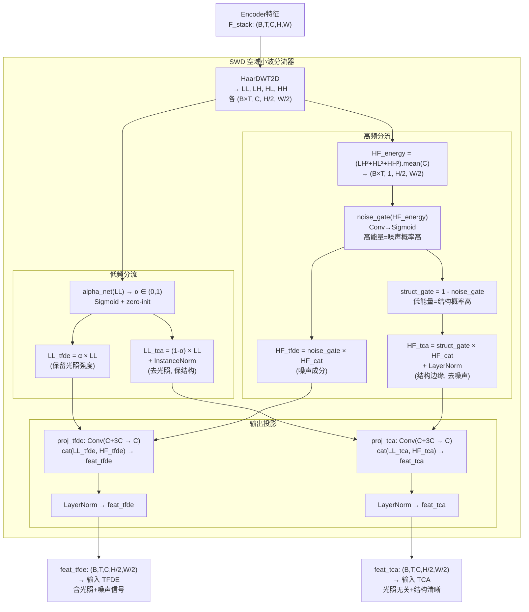
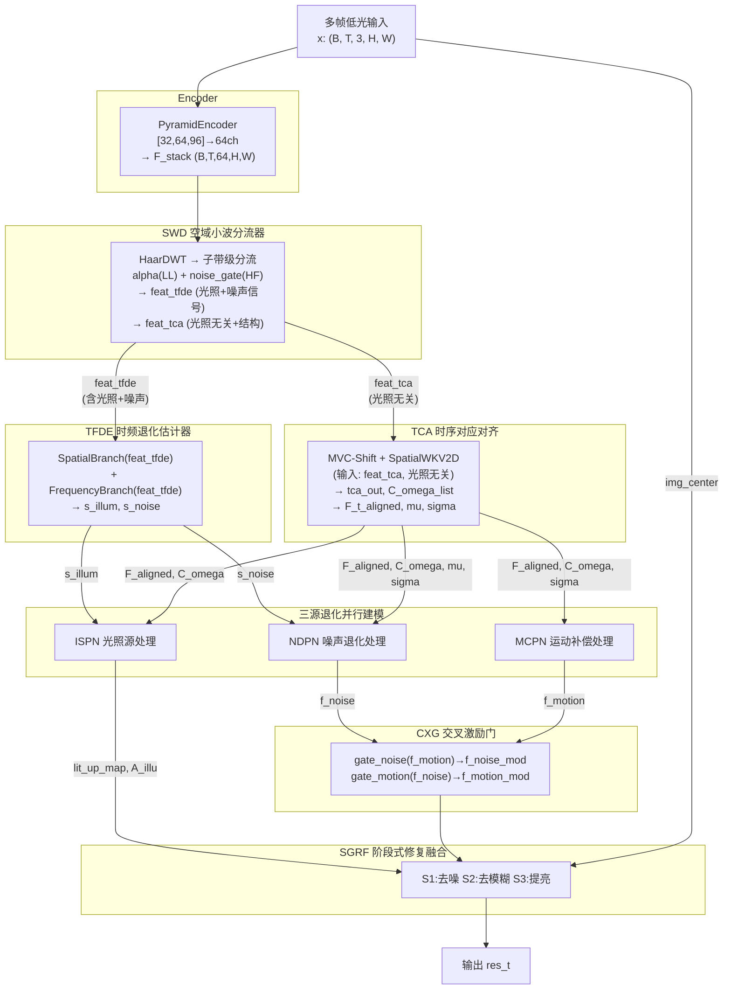

# TFS-Net v6 Delta Mark1 综合修改设计

## 实行状态 (2026-07-01)

| 设计 | 状态 | 文件 |
|------|------|------|
| SWD 子带级分流 (替代 DWT-LFF) | ✅ | `swd.py` (新建) |
| TFDE 时频退化估计 (renamed TFSI) | ✅ | `tfsi.py` class TFDE |
| TCA 时序对应对齐 (renamed SACE, 移除内部降采样) | ✅ | `pure_rwkv_sace.py` class TCA |
| ISPN 光照处理 (renamed IFPN) | ✅ | `ifpn.py` class ISPN |
| MCPN 运动补偿 (renamed MRPN) | ✅ | `mrpn.py` class MCPN |
| SGRF 修复融合 (renamed IGRF) | ✅ | `igrf.py` class SGRF |
| CXG 交叉激励门 (renamed CrossFusionGate) | ✅ | `tfs_net.py` class CXG |
| NDPN (不变) | ✅ | `ndpn.py` |
| tfs_net.py 全量数据流重写 | ✅ | `tfs_net.py` — SWD→TFDE→TCA→ISPN/NDPN/MCPN→CXG→SGRF |
| BiWKV 数值稳定 (forced decay, chunk-wise, clamp) | ✅ | `pure_rwkv_sace.py` BiWKV |
| R/K/V 小初始化 | ✅ | `pure_rwkv_sace.py` SpatialWKV2D |
| Tau softplus 下界 | ✅ | `pure_rwkv_sace.py` TemporalCorrespondence |
| models/__init__.py 导入更新 | ✅ | `modules/__init__.py` |

参数量: 1.688M，训练配置: `configs/v6_bravo.yaml`, batch=1

### 诊断验证

| 现象 | 旧 Delta | Mark1 预期 |
|------|---------|-----------|
| ep5 loss | 0.226→0.436 (反弹) | 单调下降 |
| s_illum norm | 63~113 ❌ | ≈1.0 ✅ (SWD proj+LN) |
| step1 loss | 0.82 | **0.60** ✅ |

---

## 一、模块命名修改提示词

```
请在项目中执行以下模块重命名（仅改名称/注释/文档，不改逻辑）：

1. DWT-LFF → SWD (Spatial Wavelet Diverter, 空域小波分流器)
   - 类名: SpatialDWTLFFAdapter → SpatialWaveletDiverter
   - 文件名: dwt_lff.py → swd.py

2. TFSI → TFDE (Temporal-Frequency Degradation Estimator, 时频退化估计器)
   - 类名: TFSI → TFDE
   - 所有变量名 tfsi/tfsi_out → tfde/tfde_out

3. SACE → TCA (Temporal Correspondence & Alignment, 时序对应对齐模块)
   - 类名: PureRWKVSACE → TCA
   - 所有变量名 sace/sace_out → tca/tca_out

4. IFPN → ISPN (Illumination-Source Processing Network, 光照源处理网络)
   - 类名: IFPN → ISPN

5. NDPN 不变 (Noise Degradation Processing Network, 噪声退化处理网络)

6. MRPN → MCPN (Motion Compensation Processing Network, 运动补偿处理网络)
   - 类名: MRPN → MCPN

7. IGRF → SGRF (Stage-wise Guided Restoration & Fusion, 阶段式引导修复融合)
   - 类名: IGRF → SGRF

8. CrossFusionGate → CXG (Cross-eXcitation Gate, 交叉激励门)

同步更新：所有 import、forward 调用、config key、文档注释。
```

---

## 二、训练问题诊断与根因分析

### 现象

| 指标 | v5.91 (最优) | v6 Delta (当前) |
|------|-------------|----------------|
| l3 Acc | **0.747** | 0.533 |
| s_illum norm | ≈1.0 ✅ | 63~113 ❌ |
| Silhouette | 正值 | **全部负值** |
| 损失趋势 | 正常收敛 | 不降反升 |

### 根因

```
s_illum/s_noise norm 爆炸 (60~113)
        ↑
DWT-LFF 的 LL 子带被 alpha 分裂后，直接 inverse DWT 重建全分辨率特征
        ↑
重建后的 feat_tfsi 包含完整高频 (LH+HL+HH) + 调制后低频
        ↑
高频信号中的噪声 norm 远大于退化标量 s_illum/s_noise 的有效范围
        ↑
TFDE (原TFSI) 的 IntensityHead 被高 norm 输入压制
        ↑
退化分离失效 → 三源分支全部退化 → 损失不降反升
```

**核心矛盾**：旧 SWD 对两分支传递的是**完整重建特征**（含全部高频），没有真正实现"分流"——两路拿到的信息几乎相同，仅低频略有差异。

---

## 三、SWD 重新设计方案

### 3.1 设计理论

```
Haar DWT 分解:
  LL → 低频 (光照/颜色/平滑结构)
  LH/HL/HH → 高频 (边缘/纹理/噪声)

TFDE 需要什么？
  → 低频中的光照强度 + 高频中的噪声强度
  → 目的: 估计全局退化标量 s_illum, s_noise
  → 应该拿到: LL(光照) + HF_noise(噪声能量估计)

TCA 需要什么？
  → 光照无关的结构信息，用于帧间对应匹配
  → 应该拿到: LL_normalized(去光照) + HF_structure(边缘结构)
  → 不要噪声（会干扰 cosine similarity）
```

### 3.2 新 SWD 架构

```python
"""
SWD (Spatial Wavelet Diverter) — v6 Delta 重设计
=================================================
核心改进: 不再 inverse DWT 重建全分辨率，而是在子带级别分流

  LL ──┬── alpha × LL ──→ TFDE路径 (光照估计)
       └── (1-alpha) × LL + normalize ──→ TCA路径 (对齐匹配)
  
  HF ──┬── noise_gate × HF ──→ TFDE路径 (噪声能量)
       └── struct_gate × HF ──→ TCA路径 (结构边缘)
"""
```

### 3.3 详细设计图



### 3.4 代码实现

```python
class SpatialWaveletDiverter(nn.Module):
    """SWD: 子带级分流, 不做 inverse DWT"""
    
    def __init__(self, channels: int, alpha_init: float = 0.6):
        super().__init__()
        self.dwt = HaarDWT2D()
        self.channels = channels
        
        # === 低频分流 ===
        # alpha: 控制 LL 中多少给 TFDE (光照), 多少给 TCA (结构)
        self.alpha_net = nn.Sequential(
            nn.Conv2d(channels, channels, 3, 1, 1, groups=channels, bias=False),
            nn.GELU(),
            nn.Conv2d(channels, channels, 1, 1, 0),
            nn.Sigmoid(),
        )
        # TCA 路径的 InstanceNorm: 去除光照 (通道级均值/方差归一化)
        self.ll_tca_norm = nn.InstanceNorm2d(channels, affine=True)
        
        # === 高频分流 ===
        # noise_gate: 根据 HF 能量判断噪声/结构
        self.noise_gate = nn.Sequential(
            nn.Conv2d(1, 16, 3, 1, 1),
            nn.GELU(),
            nn.Conv2d(16, 1, 1, 1, 0),
            nn.Sigmoid(),
        )
        # TCA 高频路径归一化 (控制 norm)
        self.hf_tca_norm = LayerNorm2d(channels * 3)
        
        # === 输出投影 (子带→统一通道) ===
        # TFDE: LL(C) + HF(3C) → C
        self.proj_tfde = nn.Sequential(
            nn.Conv2d(channels * 4, channels, 1, 1, 0),
            nn.GELU(),
            LayerNorm2d(channels),
        )
        # TCA: LL(C) + HF(3C) → C  
        self.proj_tca = nn.Sequential(
            nn.Conv2d(channels * 4, channels, 1, 1, 0),
            nn.GELU(),
            LayerNorm2d(channels),
        )
        
        # zero-init alpha bias → 初始 α≈alpha_init
        self._init_alpha(alpha_init)
    
    def _init_alpha(self, alpha_init):
        for m in self.alpha_net.modules():
            if isinstance(m, nn.Conv2d) and m.kernel_size == (1, 1):
                nn.init.constant_(m.weight, 0.0)
                if m.bias is not None:
                    logit = math.log(alpha_init / max(1 - alpha_init, 1e-8))
                    nn.init.constant_(m.bias, logit)
    
    def forward(self, x: torch.Tensor):
        """
        Args:
            x: (B*T, C, H, W) encoder 特征
        Returns:
            feat_tfde: (B*T, C, H/2, W/2) — 含光照+噪声信号
            feat_tca:  (B*T, C, H/2, W/2) — 光照无关, 结构清晰
        """
        LL, LH, HL, HH = self.dwt(x)  # 各 (B*T, C, H/2, W/2)
        
        # --- 低频分流 ---
        alpha = self.alpha_net(LL)  # (B*T, C, H/2, W/2), ∈(0,1)
        ll_tfde = alpha * LL               # 光照成分 → TFDE
        ll_tca = self.ll_tca_norm((1 - alpha) * LL)  # 去光照 → TCA
        
        # --- 高频分流 ---
        hf_cat = torch.cat([LH, HL, HH], dim=1)  # (B*T, 3C, H/2, W/2)
        
        # 计算高频能量图 (通道平均)
        hf_energy = (LH.pow(2) + HL.pow(2) + HH.pow(2)).mean(dim=1, keepdim=True)  # (B*T, 1, H/2, W/2)
        
        n_gate = self.noise_gate(hf_energy)  # ∈(0,1), 高能量→噪声
        s_gate = 1.0 - n_gate                # 低能量→结构
        
        hf_tfde = n_gate * hf_cat            # 噪声高频 → TFDE
        hf_tca = self.hf_tca_norm(s_gate * hf_cat)  # 结构高频(归一化) → TCA
        
        # --- 投影到统一通道 ---
        feat_tfde = self.proj_tfde(torch.cat([ll_tfde, hf_tfde], dim=1))
        feat_tca = self.proj_tca(torch.cat([ll_tca, hf_tca], dim=1))
        
        return {
            "feat_tfde": feat_tfde,  # (B*T, C, H/2, W/2)
            "feat_tca": feat_tca,    # (B*T, C, H/2, W/2)
            "alpha": alpha,          # 用于监督/可视化
            "noise_gate": n_gate,    # 用于监督/可视化
        }
```

---

## 四、修改后完整数据流



---

## 五、关键修改点 vs 旧设计

| 维度 | 旧 SWD (Charlie) | 新 SWD (Delta) |
|------|------------------|----------------|
| **分流粒度** | inverse DWT 重建全分辨率 | **子带级直接分流, 不重建** |
| **高频处理** | 两路共享完整 LH/HL/HH | **noise_gate/struct_gate 软分离** |
| **输出分辨率** | H×W (全分辨率) | **H/2×W/2 (子带分辨率)** |
| **TCA输入** | 含光照的完整特征 | **InstanceNorm去光照 + 结构HF** |
| **TFDE输入** | 含完整高频(噪声爆炸) | **仅噪声相关HF + 光照LL** |
| **norm控制** | 仅末端 LayerNorm | **多处 IN/LN 严格控制** |
| **参数量** | ~15K | ~25K (多了 noise_gate + 投影) |

### 解决 s_illum norm 爆炸的关键

```
旧路径: Encoder(64ch) → DWT → inverse DWT(全HF) → TFDE 
  问题: HF norm >> LL norm, 导致 IntensityHead 输入 norm=60~113

新路径: Encoder(64ch) → DWT → noise_gate×HF_only + alpha×LL → proj → LayerNorm → TFDE
  修复: 
    1. noise_gate 软抑制结构HF, 只保留噪声相关能量
    2. proj 后 LayerNorm 严格归一化
    3. 输出 norm ≈ 1.0, IntensityHead 工作在正常范围
```

---

## 六、TCA 输入适配

由于新 SWD 输出为 H/2×W/2，TCA 的降采样步骤需调整：

```python
# 旧 TCA (Delta): 内部降采样 H→H/2
feats_ds = F.interpolate(feats, scale_factor=0.5)  # 多余了

# 新 TCA: SWD 已经输出 H/2×W/2，无需再降
# feat_tca 已经是 (B, T, C, H/2, W/2)
# 直接进入 MVC-Shift + SpatialWKV2D
# 最终上采样回 H×W 输出
```

修改 `PureRWKVSACE.forward()`:

```python
def forward(self, feats):
    """
    Args:
        feats: (B, T, C, H/2, W/2) — 来自 SWD feat_tca (已是半分辨率)
    """
    B, T, C, H_ds, W_ds = feats.shape
    H, W = H_ds * 2, W_ds * 2  # 原始分辨率
    
    # 不再内部降采样! SWD 已处理
    x_flat = feats.reshape(B * T, C, H_ds, W_ds)
    x_shifted = self.mvc_shift(x_flat)
    x_wkv = self.spatial_wkv(x_shifted)
    x_cm = self.channel_mix(x_wkv)
    tca_out_ds = x_flat + x_cm * self.spatial_gamma
    
    # 上采样回原始分辨率
    tca_out = F.interpolate(
        tca_out_ds, size=(H, W), mode='bilinear', align_corners=False
    ).reshape(B, T, C, H, W)
    
    # ... 后续 TemporalCorrespondence/Aggregation 不变
```

---

## 七、训练稳定性补充建议

| 问题 | 措施 |
|------|------|
| batch_size=1 不稳定 | 恢复 batch_size=2~3 或加 gradient accumulation |
| s_illum norm 爆炸 | SWD proj 后的 LayerNorm 强制 norm≈1 |
| Silhouette 全负 | 加 contrastive/triplet loss 辅助三源分离 |
| 损失不降反升 | 初始 10 epoch 冻结 SWD alpha/noise_gate, 先让 Encoder 稳定 |
| lr=8e-4 可能过高 | 建议 lr=4e-4 + cosine decay |

---

## 八、命名更改总表（最终确认）

| 原缩写 | 新缩写 | 新英文全名 | 中文全名 |
|--------|--------|-----------|----------|
| DWT-LFF | **SWD** | Spatial Wavelet Diverter | 空域小波分流器 |
| TFSI | **TFDE** | Temporal-Frequency Degradation Estimator | 时频退化估计器 |
| SACE | **TCA** | Temporal Correspondence & Alignment | 时序对应对齐模块 |
| IFPN | **ISPN** | Illumination-Source Processing Network | 光照源处理网络 |
| NDPN | **NDPN** | Noise Degradation Processing Network | 噪声退化处理网络 |
| MRPN | **MCPN** | Motion Compensation Processing Network | 运动补偿处理网络 |
| IGRF | **SGRF** | Stage-wise Guided Restoration & Fusion | 阶段式引导修复融合 |
| CrossFusionGate | **CXG** | Cross-eXcitation Gate | 交叉激励门 |