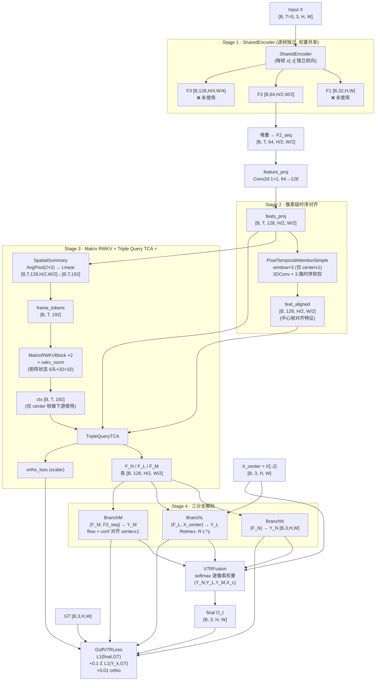
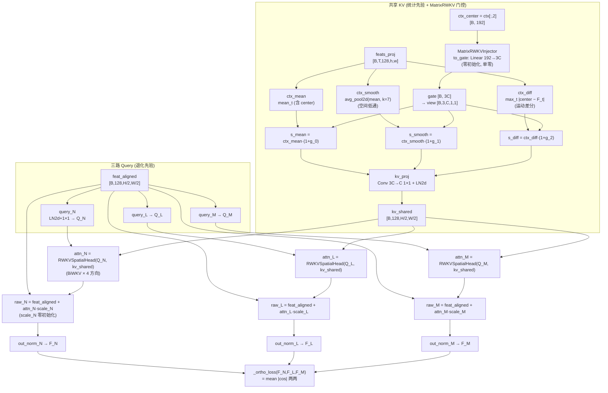

# Golf v7 重新设计: 矩阵状态 RWKV + 多元噪声分割

> 日期: 2026-09-28 | 仓库: TFS-Net/docs/v7/02-v7-architecture-design.md  
> 前置文档: `01-RWKV-mechanism-survey.md` (RWKV-4~8 机制调研)  
> 目标: 在多元噪声分割结构（N/L/M 三分支）框架内，用 RWKV-5/6 级别的矩阵状态机制替换当前 naive grouped RWKV-4，形成完整设计方案

---

## 一、当前 v7 架构诊断

### 1.1 当前架构 (正在训练的 baseline)

```
Input [B, T=5, 3, H, W]
  ↓
Stage 1: SharedEncoder (逐帧, 0.41M)
  → F1 [B,T,32,H,W], F2 [B,T,64,H/2,W/2], F3 [B,T,128,H/4,W/4] (F3 未用)
  ↓
Stage 2: feature_proj (1×1 conv 64→128) + PixelTemporalAttentionSimple
  → feat_aligned [B, 128, H/2, W/2] (中心帧, 3D conv window=3)
  ↓
Stage 3: FrameLevelRWKV (8 独立 RWKV-4 头, FiLM 调制)
  → feats_rwkv [B, T, 128, H/2, W/2] + frame_ctx [B, T, 128]
  ↓
Stage 4: feat_aligned + feat_center_rwkv → 2×NAFBlock → Upsample3x3 → to_rgb
  → out [B, 3, H, W] + residual_gamma × X_center
```

**总参数: 1.04M** | **RWKV 部分: ~0.6M** (8头 × 16维 × 2块)

### 1.2 关键问题

| 问题 | 严重性 | 说明 |
|------|--------|------|
| **RWKV-4 向量状态** | 致命 | 每头状态仅 16 标量 (head_dim=16)，几乎无法存储有意义的帧间关系 |
| **头间零通信** | 严重 | 8 头完全独立，无法学习跨通道模式 |
| **无噪声分割** | 严重 | 单分支解码器，未利用 N/L/M 退化分解的物理先验 |
| **Global Pool 信息损失** | 中等 | AdaptiveAvgPool2d(1) 丢失所有空间信息，FiLM 只能做全局调制 |
| **F3 未使用** | 轻微 | Encoder 花参数算了 F3 但被丢弃 |

### 1.3 当前训练进度 (baseline 参照)

- Epoch 9/60 运行中 (2026-09-28 11:00)
- Loss 在 0.03~0.36 范围波动
- 预计 epoch 10 首次验证 PSNR
- Golf R2 baseline: val PSNR=20.14 (使用三分支 + TCA-RWKV, 3.50M 参数)

---

## 二、重新设计方案

### 2.1 设计原则

1. **RWKV 用对地方**: 帧级语义建模（非像素级对齐）— 延续 v7 已验证的正确方向
2. **矩阵状态是必需品**: 升级到 RWKV-5/6 的 $S \in \mathbb{R}^{d \times d}$ 矩阵状态
3. **恢复三分支结构**: N/L/M 退化分解是 Golf 家族的核心物理先验
4. ~~**RWKV 多头 = 退化分量分离**: 多头自然对应 N/L/M，不需要独立的 TCA 解耦模块~~
   > ⚠️ **本原则未落地，且最终被放弃**（详见 §2.2 勘误与 §十三）：
   > ①「多头按 N/L/M 分工」从未实现——6 头共享同一 `base_decay` 初始化与共享 LoRA，
   > 无角色归纳偏置，实测训练后头间无分化；
   > ② v7r-v3 最终**反而**重新引入了独立的解耦模块 `TripleQueryTCA`（三路查询）。
5. **参数预算 ≤ 3.5M**: 与 Golf R2 可比，RTX 4090 可训练
   > ⚠️ v7r-v2 = 3.51M，v7r-v3 = 3.75M，**均已突破 3.5M**。

### 2.2 架构总览: **Golf v7-R (RWKV-Redesigned)**

> ⚠️ **本节描述的是 v7r-v2 的原始设计蓝图，与实际落地代码存在若干偏差**。
> v7r-v2 与 v7r-v3 的**真实** Stage 3/5 已分叉：
> - **v7r-v2**：Stage 3 = `SpatialSummary → MatrixRWKV×2 → ContextDecomposition → BranchFiLM`；Stage 5 = `AdaptiveFusion`（复用 R2）
> - **v7r-v3**：Stage 3 = `TripleQueryTCA`（三路 Q × 统计先验 KV，含 `MatrixRWKVInjector` 门控）；
>   Stage 5 = `V7RFusion`（替代 AdaptiveFusion，修 §11.2 毁图缺陷）
>
> **v7r-v3 的精确结构图与逐条数据流审查见 §十三**（`golfnet_v7r_v3.py` 实码）。
> 下方 ASCII 图保留作 v2 设计存档；其中已知与代码不符处已就地标注。

```
Input [B, T=5, 3, H, W]
  │
  ├── Stage 1: SharedEncoder (逐帧独立, 0.41M, 复用 Golf R2)
  │   → F1 [B,T,32,H,W]        ⚠️ 计算后丢弃 (v2/v3 均只用 F2)
  │   → F2 [B,T,64,H/2,W/2]
  │
  ├── Stage 2: PixelTemporalAttention (像素级对齐, 实测 ~0.024M)
  │   Feature Proj: 1×1 conv 64→128
  │   3D Conv (窗口=3): 捕捉局部运动
  │   → feat_aligned [B, 128, H/2, W/2]
  │
  ├── Stage 3: MatrixRWKV-TCA ⭐ (帧级多头, 矩阵状态, ~0.55M)
  │   │
  │   │  3.1 Spatial Summary (替代 Global Pool)
  │   │      ⚠️ 文档原写 AvgPool2d(4)→C×16；实际所有 config 用 spatial_size=2
  │   │      AdaptiveAvgPool2d(2) → [B, T, C, 2, 2]
  │   │      Flatten → [B, T, C×4] → Linear(512→192) (实测 0.099M, 非 0.39M)
  │   │
  │   │  3.2 Multi-Head Matrix RWKV (h=6, d=32, 矩阵状态 32×32)
  │   │      【展望·未实现】以下 Head 角色分工仅为设计愿景，代码无支撑：
  │   │      ┌─ Head 1-2: Noise-aware (衰减快, 捕捉 i.i.d. 噪声模式)   ❌ 无代码
  │   │      ├─ Head 3-4: Illumination-aware (衰减慢, 捕捉光照趋势)     ❌ 无代码
  │   │      └─ Head 5-6: Motion-aware (动态衰减, 运动自适应)           ❌ 无代码
  │   │      实际: 6 头共享统一 base_decay=0.5 初始化 + 共享 LoRA，无角色偏置
  │   │      每头: s_t = s_{t-1} · diag(w_t) + v_t^T · k_t
  │   │      w_t 数据相关 (RWKV-6 风格)
  │   │      → frame_ctx [B, T, D=192]
  │   │
  │   │  3.3 Context Decomposition (替代 TCA 解耦)
  │   │      Linear 192 → {ctx_N(64), ctx_L(64), ctx_M(64)}
  │   │      Ortho regularization on {ctx_N, ctx_L, ctx_M}
  │   │      ⚠️ v3 中此模块被 TripleQueryTCA 取代 (见 §十二/§十三)
  │   │
  │   │  3.4 Spatial Injection (FiLM per branch)
  │   │      ctx_X → scale_X, shift_X (1×1 conv)
  │   │      F_X = feat_aligned * (1 + scale_X) + shift_X
  │   │      → F_N, F_L, F_M [B, 128, H/2, W/2]
  │   │      ⚠️ v3 中 FiLM 被 TCA 的 LayerScale 残差 (F=feat+attn·scale) 取代
  │
  ├── Stage 4: 三分支处理 (~1.85M, 复用/简化 Golf R2)
  │   ├── BranchN (去噪, ~0.60M): 简化版, 2×NAFBlock + Upsample3x3
  │   ├── BranchL (光照, ~0.55M): Retinex + gamma + 2×NAFBlock + Upsample3x3
  │   └── BranchM (运动, ~0.70M): 简化流估计 + 2×NAFBlock + Upsample3x3
  │   → Y_N, Y_L, Y_M [B, 3, H, W]
  │
  └── Stage 5: AdaptiveFusion (~0.06M, 复用 Golf R2)
      → O [B, 3, H, W]
      ⚠️ v3 替换为 V7RFusion (12.9K, 不在 RGB 上跑 NAFBlock)
```

**总参数预算（历史值，已被实测取代）**: 原文写 ~2.9M；§2.5 明细表为 ~3.6M；
实测 **v7r-v2 = 3.51M / v7r-v3 = 3.75M**。原文 2.9M 系漏算 §2.5 明细项所致，以实测为准。

### 2.3 Stage 3 详细设计: MatrixRWKV-TCA

这是本次重新设计的核心创新——用矩阵状态 RWKV 替代原有 TCA-RWKV 的解耦机制。
> ⚠️ 本节描述的 `SpatialSummary → MatrixRWKV → ContextDecomposition → BranchFiLM`
> 是 **v7r-v2** 的 Stage 3。v7r-v3 已将解耦改由 `TripleQueryTCA`（三路查询 × 统计先验 KV）
> 承担，MatrixRWKV 降级为门控注入（见 §十二/§十三）。

#### 2.3.1 Spatial Summary (替代 Global Pool)

**问题**: 当前 `AdaptiveAvgPool2d(1)` 将 H/2×W/2 压缩到 1×1，丢失所有空间结构。

**方案**: 使用 `AdaptiveAvgPool2d(4)` 保留 4×4=16 个空间位置，再线性投影。

```python
class SpatialSummary(nn.Module):
    def __init__(self, in_dim=128, out_dim=192, spatial_size=4):
        super().__init__()
        self.pool = nn.AdaptiveAvgPool2d(spatial_size)
        self.proj = nn.Linear(in_dim * spatial_size * spatial_size, out_dim)
        self.ln = nn.LayerNorm(out_dim)

    def forward(self, x):
        # x: [B, T, C, H, W]
        B, T, C, H, W = x.shape
        tokens = []
        for t in range(T):
            pooled = self.pool(x[:, t])          # [B, C, 4, 4]
            flat = pooled.flatten(1)              # [B, C*16]
            tokens.append(self.proj(flat))        # [B, D]
        tokens = torch.stack(tokens, dim=1)       # [B, T, D]
        return self.ln(tokens)
```

**参数**: 128×16×192 + 192 + 192×2 ≈ 393K

#### 2.3.2 Matrix RWKV Time Mixing (RWKV-6 风格)

**核心改进: 从向量状态升级到矩阵状态**

```python
class MatrixRWKVTimeMix(nn.Module):
    """
    RWKV-6 风格 Time Mixing: 矩阵值状态 + 数据相关衰减
    
    状态更新: S_t = S_{t-1} · diag(w_t) + v_t^T · k_t
    w_t = exp(-exp(base_decay + decay_lora(shifted_x)))  # 数据相关
    """
    def __init__(self, dim: int, num_heads: int = 6, head_size: int = 32):
        super().__init__()
        self.dim = dim           # 192
        self.num_heads = num_heads
        self.head_size = head_size  # d = 32, 状态 S ∈ R^{32×32}
        assert dim == num_heads * head_size
        
        # Projections (shared across heads, then reshape to multi-head)
        self.W_r = nn.Linear(dim, dim, bias=False)
        self.W_k = nn.Linear(dim, dim, bias=False)
        self.W_v = nn.Linear(dim, dim, bias=False)
        self.W_o = nn.Linear(dim, dim, bias=False)
        
        # Token Shift (V7 简单 lerp 风格)
        self.mix_r = nn.Parameter(torch.ones(1, 1, dim) * 0.5)
        self.mix_k = nn.Parameter(torch.ones(1, 1, dim) * 0.5)
        self.mix_v = nn.Parameter(torch.ones(1, 1, dim) * 0.5)
        
        # 数据相关衰减 (RWKV-6 风格)
        self.base_decay = nn.Parameter(torch.ones(num_heads, head_size) * 0.5)
        self.decay_lora_down = nn.Linear(dim, dim // 4, bias=False)
        self.decay_lora_up = nn.Linear(dim // 4, dim, bias=False)
        
        # 门控 (V5 SiLU gate)
        self.W_g = nn.Linear(dim, dim, bias=False)
        
        # Per-head GroupNorm (V5 风格, 替代归一化分母)
        self.group_norm = nn.GroupNorm(num_heads, dim)
        
    def forward(self, x):
        # x: [B, T, D]
        B, T, D = x.shape
        H, d = self.num_heads, self.head_size
        
        # Token shift: x_{t-1} 与 x_t 的 lerp
        x_shifted = F.pad(x[:, :-1], (0, 0, 1, 0))  # [B, T, D], 第0帧 shift=0
        
        xr = x * self.mix_r + x_shifted * (1 - self.mix_r)
        xk = x * self.mix_k + x_shifted * (1 - self.mix_k)
        xv = x * self.mix_v + x_shifted * (1 - self.mix_v)
        
        # Projections
        r = self.W_r(xr).view(B, T, H, d)  # receptance
        k = self.W_k(xk).view(B, T, H, d)  # key
        v = self.W_v(xv).view(B, T, H, d)  # value
        g = torch.sigmoid(self.W_g(x))      # gate [B, T, D]
        
        # 数据相关衰减 w_t
        decay_delta = self.decay_lora_up(
            torch.tanh(self.decay_lora_down(xk))
        ).view(B, T, H, d)
        # w_t = exp(-exp(base + delta)), 保证 w_t ∈ (0, 1)
        w = torch.exp(-torch.exp(
            self.base_decay.unsqueeze(0).unsqueeze(0) + decay_delta
        ))  # [B, T, H, d]
        
        # 递归: 矩阵状态更新
        # S_t = S_{t-1} · diag(w_t) + v_t^T · k_t
        state = torch.zeros(B, H, d, d, device=x.device, dtype=x.dtype)
        outputs = []
        
        for t in range(T):
            k_t = k[:, t]           # [B, H, d]
            v_t = v[:, t]           # [B, H, d]
            r_t = r[:, t]           # [B, H, d]
            w_t = w[:, t]           # [B, H, d]
            
            # 状态更新: S = S · diag(w) + v^T · k (外积)
            # state[b,h,i,j]: i=value 通道, j=key 通道
            state = state * w_t.unsqueeze(-2) + torch.einsum('bhi,bhj->bhij', v_t, k_t)
            # 读取: r 与 key 维 (j) 收缩, 输出在 value 维 (i) → [B, H, d]
            o_t = torch.einsum('bhj,bhij->bhi', r_t, state)
            outputs.append(o_t)
        
        out = torch.stack(outputs, dim=1)  # [B, T, H, d]
        out = out.reshape(B, T, D)
        
        # GroupNorm per head + gate
        out = self.group_norm(out.transpose(1, 2)).transpose(1, 2)
        out = out * g  # SiLU-like gate
        out = self.W_o(out)
        
        return out
```

> ⚠️ **勘误 (2026-10-08)**：上面代码块的读出索引已按 §8.7 修正为
> `einsum('bhj,bhij->bhi')`（r 与 **key 维** 收缩，输出在 value 维）。
> 本文档 09-28 首版原文曾误写为 `einsum('bhd,bhde->bhe')`（r 与 value 维收缩），
> 该错误已在 §8.7 于实现中修正，但 §2.3.2 原文直到本次才回改。**代码一直是正确版**。
> 另：`ReLUSquaredMLP` 与 `MatrixRWKVBlock` 实际实现补加了 LayerScale(0.1)，见 §11.1。

**与当前 RWKV-4 对比**:

| | 当前 (V4) | 新设计 (V6) |
|---|---|---|
| 状态形状 | 向量 $\mathbb{R}^{16}$ (per head) | 矩阵 $\mathbb{R}^{32 \times 32}$ (per head) |
| 总状态容量 | 8×16 = 128 标量 | 6×32×32 = 6,144 标量 (**48×**) |
| 衰减 | 固定 `time_decay` | 数据相关 `w_t = f(x_t)` (LoRA) |
| 状态更新 | $s_t = e^{-w} s_{t-1} + k_t v_t$ (逐元素) | $S_t = S_{t-1} \text{diag}(w_t) + v_t^T k_t$ (外积) |
| 头间通信 | 无 | 通过共享 W_r/W_k/W_v + GroupNorm |
| 参数量 | ~0.6M (含 8 个独立头) | ~0.35M (参数更高效) |

**参数估算**: 4 × (192×192) + 192×48 + 48×192 + 192×32 + GroupNorm ≈ 166K

#### 2.3.3 Channel Mix (V7 ReLU² MLP)

```python
class ReLUSquaredMLP(nn.Module):
    """V7 风格 Channel Mix: 简洁的 2-layer MLP"""
    def __init__(self, dim, hidden_ratio=3):
        super().__init__()
        hidden = dim * hidden_ratio
        self.W1 = nn.Linear(dim, hidden, bias=False)
        self.W2 = nn.Linear(hidden, dim, bias=False)
        self.mix = nn.Parameter(torch.ones(1, 1, dim) * 0.5)

    def forward(self, x):
        x_shifted = F.pad(x[:, :-1], (0, 0, 1, 0))
        xm = x * self.mix + x_shifted * (1 - self.mix)
        return self.W2(F.relu(self.W1(xm)).square())
```

**参数**: 192×576 + 576×192 ≈ 221K

#### 2.3.4 MatrixRWKVBlock (Time Mix + Channel Mix)

```python
class MatrixRWKVBlock(nn.Module):
    def __init__(self, dim=192, num_heads=6, head_size=32):
        super().__init__()
        self.ln1 = nn.LayerNorm(dim)
        self.ln2 = nn.LayerNorm(dim)
        self.time_mix = MatrixRWKVTimeMix(dim, num_heads, head_size)
        self.channel_mix = ReLUSquaredMLP(dim)

    def forward(self, x):
        x = x + self.time_mix(self.ln1(x))
        x = x + self.channel_mix(self.ln2(x))
        return x
```

**单块参数**: ~387K → **2 块 × 387K = 774K**

#### 2.3.5 Context Decomposition (替代 TCA 解耦)

**核心思想**: RWKV 多头输出自然包含不同退化分量的信息，通过线性投影 + 正交正则化，显式解耦为 N/L/M 三个上下文向量。

> ⚠️ **前提修正（2026-10-08）**：「RWKV 多头输出自然包含不同退化分量的信息」是**未经验证的假设**——
> 6 头共享统一初始化与共享 LoRA，无任何迫使头间分化的机制（见 §2.6 #2）。
> 本模块（`ContextDecomposition`）仅适用于 **v7r-v2**；v7r-v3 已用 `TripleQueryTCA`
> 的显式三路查询替代，不再依赖多头分工（见 §十二/§十三）。

```python
class ContextDecomposition(nn.Module):
    """将 RWKV 输出解耦为 N/L/M 三个上下文"""
    def __init__(self, dim=192, ctx_dim=64):
        super().__init__()
        self.proj_N = nn.Linear(dim, ctx_dim)
        self.proj_L = nn.Linear(dim, ctx_dim)
        self.proj_M = nn.Linear(dim, ctx_dim)
        self.ln_N = nn.LayerNorm(ctx_dim)
        self.ln_L = nn.LayerNorm(ctx_dim)
        self.ln_M = nn.LayerNorm(ctx_dim)

    def forward(self, frame_ctx):
        # frame_ctx: [B, T, D] → 取中心帧
        center = frame_ctx[:, frame_ctx.shape[1] // 2]  # [B, D]
        ctx_N = self.ln_N(self.proj_N(center))  # [B, 64]
        ctx_L = self.ln_L(self.proj_L(center))
        ctx_M = self.ln_M(self.proj_M(center))
        return ctx_N, ctx_L, ctx_M

    def ortho_loss(self, ctx_N, ctx_L, ctx_M):
        """正交约束: 三个上下文应尽量正交"""
        cos_NL = F.cosine_similarity(ctx_N, ctx_L, dim=-1).abs().mean()
        cos_NM = F.cosine_similarity(ctx_N, ctx_M, dim=-1).abs().mean()
        cos_LM = F.cosine_similarity(ctx_L, ctx_M, dim=-1).abs().mean()
        return (cos_NL + cos_NM + cos_LM) / 3
```

**参数**: 3 × (192×64 + 64 + 64×2) ≈ 37.5K

#### 2.3.6 Spatial Injection (FiLM per branch)

```python
class BranchFiLM(nn.Module):
    """将上下文注入空间特征 (FiLM 调制)"""
    def __init__(self, ctx_dim=64, feat_dim=128):
        super().__init__()
        self.to_scale = nn.Linear(ctx_dim, feat_dim)
        self.to_shift = nn.Linear(ctx_dim, feat_dim)
        # 零初始化 → 初始时 FiLM 是恒等变换
        nn.init.zeros_(self.to_scale.weight)
        nn.init.zeros_(self.to_scale.bias)
        nn.init.zeros_(self.to_shift.weight)
        nn.init.zeros_(self.to_shift.bias)

    def forward(self, feat, ctx):
        # feat: [B, 128, H/2, W/2], ctx: [B, 64]
        scale = self.to_scale(ctx)[:, :, None, None]  # [B, 128, 1, 1]
        shift = self.to_shift(ctx)[:, :, None, None]
        return feat * (1 + scale) + shift
```

**参数**: 3 × (64×128 + 128) × 2 ≈ 49.5K

### 2.4 三分支简化方案

为控制参数预算，对 Golf R2 的三分支进行简化:

#### BranchN (去噪): 0.60M
- 去掉 var_map 通路（矩阵 RWKV 的 Noise 头已捕捉噪声统计）
- 保留: 2×NAFBlock(128) + Upsample3x3 + to_rgb
- 不使用 F1 skip（节省参数，简化流程）

#### BranchL (光照): 0.55M
- 保留 Retinex 物理先验 (L_t, R_t, gamma)
- 简化: 去掉 illum_refine（低分辨率 L 直接 bilinear 到全分辨率）
- 保留: illum_head (zero-init) + 2×NAFBlock + Upsample3x3 + gamma

#### BranchM (运动): 0.70M
- 简化 FlowEstimator: 只用中心帧与相邻 2 帧（而非全部 4 帧）
- 保留: confidence gating + fusion_conv + 2×NAFBlock + Upsample3x3
- 去掉 F1 skip

### 2.5 完整参数预算

| 模块 | 设计预估 | 实测 (v2) | 说明 |
|------|--------|--------|------|
| SharedEncoder | 0.41M | 0.410M | 复用 Golf R2，不修改 |
| feature_proj | 0.01M | 0.008M | 1×1 conv 64→128 |
| PixelTemporalAttention | 0.01M | 0.024M | 3D conv 窗口=3 (文档低估 2.4×) |
| SpatialSummary | 0.39M | **0.099M** | ⚠️ 文档按 AvgPool(4)；实际 config 用 `spatial_size=2` |
| MatrixRWKVBlock ×2 | 0.77M | 0.853M | V6 矩阵状态, 6 头 (+LayerScale) |
| ContextDecomposition | 0.04M | 0.037M | 线性解耦 N/L/M (v3 被 TripleQueryTCA 取代 0.374M) |
| BranchFiLM ×3 | 0.05M | 0.050M | 上下文注入 (v3 被 TCA LayerScale 取代) |
| BranchN (简化) | 0.60M | 0.556M | 2×NAFBlock + Upsample |
| BranchL (简化) | 0.55M | 0.609M | Retinex + 2×NAFBlock |
| BranchM (简化) | 0.70M | **0.804M** | Flow + Conf + 2×NAFBlock (超预估 15%) |
| AdaptiveFusion | 0.06M | 0.063M | 复用 Golf R2 (v3 换 V7RFusion 0.0129M) |
| **总计** | **~3.6M** | **3.51M** | v2 实测；v3 = **3.75M**，突破 §2.1 的 ≤3.5M 原则 |

> 注：§2.2 overview 曾写 ~2.9M，与本表 ~3.6M 及实测 3.51/3.75M 均不一致；
> 以实测为准，overview 已就地标注。

### 2.6 设计 vs 实现偏差审计 (2026-10-08)

> 本节对照 §2.2/§2.3 的设计声明与 `models/golf_v7r/` 实码逐条核实，
> 列出**所有**已知偏差及其类型，供后续论文/复用参考。

| # | 声明处 | 设计声称 | 代码事实 | 判定 | 记录 |
|:--:|--------|----------|----------|:--:|:--:|
| 1 | §2.2 3.1 / §2.3.1 | `AdaptiveAvgPool2d(4)`，C×16→Linear，0.39M | 代码类默认 `spatial_size=4`，但**4 个 config 全设 2** → C×4，Linear(512→192)，0.099M | ⚠️ 静默简化 | 本次 ✅ |
| 2 | §2.2 3.2 / §2.1-4 | Head 1-2 噪声(快) / 3-4 光照(慢) / 5-6 运动(动态) | **未实现**：6 头共享 `base_decay=0.5` 统一初始化 + 共享 LoRA，无角色分组。实测初始每头 w=exp(−exp(0.5))≈0.1923、std=0；**60-epoch 末 (ep55) ckpt `base_decay` 头间均值**：block0 spread=0.038、block1 spread=0.010（对应 w 仅差 0.014/0.004），**仍无 1-2/3-4/5-6 分组分化** | ❌ **纯愿景，零实现** | 本次 ✅ |
| 3 | §2.3.2 伪代码 | `o = einsum('bhd,bhde->bhe')`（r×value 维） | 实码为 `('bhj,bhij->bhi')`（r×**key** 维），§8.7 已勘误 | 📄 文档错、代码对 | §8.7 + 本次回改 §2.3.2 |
| 4 | §2.3.4 | `MatrixRWKVBlock` = LN+TimeMix+LN+ChannelMix | 实码额外加 LayerScale(0.1)（修激活爆炸 std 5.6→523） | ✅ 良性复杂化 | §11.1 |
| 5 | §2.2 3.3/3.4 & Stage5 | `ContextDecomposition` + `BranchFiLM` + `AdaptiveFusion` | v3 替换为 `TripleQueryTCA` + `MatrixRWKVInjector` + `V7RFusion` | 🔄 v3 重构 | 03 文档 + §十二/§十三 |
| 6 | §2.1-5 | 参数预算 ≤3.5M | v2=3.51M / v3=3.75M | ⚠️ 已突破 | 本次 ✅ |
| 7 | §2.2 3.2 | 多头 = 退化分量分离（§2.1-4） | v3 解耦实际由 `TripleQueryTCA` 三路查询承担，与 RWKV 头无关；MatrixRWKV 降级为「时序态势→统计 KV 门控」 | ❌ 设计意图被绕开 | §十二/§十三 |

**结论**：骨架（Stage 1/2/3.3/3.4/4、v2 的 Stage 5）落地率高（≈85% 按条目），
文档明示的简化（去 var_map、±1 两帧、去 F1 skip）均如实执行。
两处「实现优于文档」（#3 读出索引、#4 LayerScale）属先实现后补文档的良性偏差，有数值留痕。
**唯一「高调宣称却零实现」的核心卖点是 #2（Head 1-6 快/慢/动态衰减分工）**——
既无分组初始化，也无结构约束，实际靠「统一初始化 + 共享 LoRA + 训练自由分化」运行。

> **处置决定 (2026-10-08)**：#2 **降级为「展望 (Future Work)」**。
> 即日起 02 文档中所有 Head 1-2/3-4/5-6 角色分工的表述一律标注为**设计愿景、未实现**，
> 不再作为已落地的架构特性引用；论文/复用需引用时按「未来工作」处理。
> 若后续要转回实现，需补齐：分组 `base_decay` 初始化（快/慢/动态三档）+ 独立衰减分支
> + 控制变量的头分工消融。其余 #1/#5/#6/#7 均为有据演进或已知简化，影响可控。

---

## 三、与 Golf R2 的关键差异

| 方面 | Golf R2 (TCA-RWKV) | Golf v7-R (MatrixRWKV-TCA) |
|------|-------------------|-----------------------------|
| **RWKV 版本** | RWKV-4 向量状态, 单头 | RWKV-6 矩阵状态, 6 多头 |
| **RWKV 操作层级** | 像素级 (逐像素时序) | 帧级 (全局语义) |
| **退化解耦** | 独立 TCA 模块 (三查询解耦) | v2: RWKV 多头 + 线性投影 + 正交约束（多头分工未实现，见 §2.6 #2）<br>v3: `TripleQueryTCA` 显式三路查询 |
| **帧间对齐** | TCA 隐式对齐 | 显式 PixelTemporalAttention + BranchM flow |
| **衰减机制** | 固定 | 数据相关 (RWKV-6 LoRA) |
| **状态容量** | ~128 标量 | ~6,144 标量 (48×) |
| **参数量** | 3.50M | ~3.6M |
| **物理先验** | Retinex (BranchL) | Retinex + 分层时序 + 正交解耦 |

---

## 四、训练方案

### 4.1 Loss 函数

```python
loss = L1(output, GT)
     + 0.1 * L1(Y_N, GT)   # 分支监督
     + 0.1 * L1(Y_L, GT)
     + 0.1 * L1(Y_M, GT)
     + 0.01 * ortho_loss    # 正交约束
```

如 pytorch_msssim 可安装:
```python
loss += 0.1 * (1 - MS_SSIM(output, GT))
```

### 4.2 训练超参 (第一阶段)

| 参数 | 值 | 说明 |
|------|-----|------|
| batch_size | 1 | RTX 4090 内存约束 |
| lr | 6e-4 | AdamW |
| epochs | 60 | 与 baseline 一致 |
| scheduler | CosineAnnealing (T_min=1e-6) | |
| crop_size | 256×256 | |
| T | 5 | |
| val_interval | 5 | 比 baseline 更频繁 |

### 4.3 实施路径

**Phase 1: 矩阵 RWKV 核心 (先验证 RWKV 升级)**
1. 实现 `MatrixRWKVTimeMix` + `MatrixRWKVBlock`
2. 替换 `frame_rwkv.py` 中的 `RWKVTimeMix`
3. 保持单分支解码器，先验证矩阵状态的效果
4. 成功标准: ep10 PSNR > 当前 baseline

**Phase 2: 三分支恢复 (加入退化分解)**
1. 实现 `ContextDecomposition` + `BranchFiLM`
2. 简化并集成 BranchN/L/M
3. 集成 AdaptiveFusion
4. 成功标准: ep30 PSNR > Golf R2 baseline (20.14)

**Phase 3: 精调与消融**
1. 头数消融 (4 vs 6 vs 8)
2. 空间摘要消融 (AvgPool 1×1 vs 4×4 vs 8×8)
3. 衰减类型消融 (固定 vs 数据相关)
4. 正交约束强度消融

---

## 五、风险与缓解

| 风险 | 概率 | 缓解 |
|------|------|------|
| 矩阵状态 T=5 收益不大 | 中 | Phase 1 快速验证; 若无增益则回退到 V5 固定衰减 |
| 3.6M 超出 GPU 内存 | 低 | batch=1 已验证 1.04M 可行; 3.6M 估计 ~10GB 可控 |
| 三分支增加训练不稳定性 | 中 | 零初始化 FiLM + 分支 loss 权重渐增 (warmup) |
| 正交约束过强限制表达 | 低 | λ_ortho = 0.01, 可调节 |
| SpatialSummary 参数过多 (393K) | 中 | 可降低 spatial_size=2 (4 位置 vs 16), 参数降至 ~100K |

---

## 六、文件规划

```
models/golf_v7r/                   # 新目录, "r" = redesigned
├── __init__.py
├── golfnet_v7r.py                 # 主网络
├── matrix_rwkv.py                 # MatrixRWKVTimeMix + Block
├── spatial_summary.py             # SpatialSummary
├── context_decomp.py              # ContextDecomposition + BranchFiLM
├── branch_n_simple.py             # 简化 BranchN
├── branch_l_simple.py             # 简化 BranchL  
├── branch_m_simple.py             # 简化 BranchM
├── loss.py                        # 多分支 + 正交 loss
└── pixel_temporal.py              # 复用 golf_v7 版本

configs/golf_v7r.yaml              # 训练配置
train_golf_v7r.py                  # 训练脚本
```

---

## 七、关键数学总结

### 矩阵状态更新 (RWKV-6 风格, 每头)

$$S_t = S_{t-1} \cdot \text{diag}(w_t) + v_t^T \cdot k_t$$

其中:
- $S_t \in \mathbb{R}^{d \times d}$ (矩阵值状态, d=32)
- $w_t = \exp(-\exp(w_{\text{base}} + \text{LoRA}(x_t))) \in (0, 1)^d$ (数据相关衰减)
- $v_t, k_t \in \mathbb{R}^d$ (值向量、键向量)
- $v_t^T \cdot k_t \in \mathbb{R}^{d \times d}$ (秩-1 外积更新)

### 输出读取

$$o_t = r_t \cdot S_t \in \mathbb{R}^d$$

其中 $r_t$ 是 receptance 向量 (控制读取)

### 退化解耦

$$[\text{ctx}_N, \text{ctx}_L, \text{ctx}_M] = [W_N, W_L, W_M] \cdot \text{RWKV}(x)_{\text{center}}$$

$$\mathcal{L}_{\text{ortho}} = \frac{1}{3}\sum_{(i,j) \in \{NL, NM, LM\}} |\cos(\text{ctx}_i, \text{ctx}_j)|$$

---

## 附录: 为什么不用 RWKV-7 (Goose) 的广义 Delta 规则?

RWKV-7 的核心升级是转移矩阵从 $\text{diag}(w_t)$ 扩展为 $\text{diag}(w_t) - \hat{\kappa}_t^T (a_t \odot \hat{\kappa}_t)$。这在 NLP 的长上下文（T=4K~32K）中非常有价值，因为矩阵状态会逐渐饱和，需要主动"忘记"过时信息。

但 LLVE 的 T=5:
1. **状态不会饱和**: 5 个秩-1 更新到 32×32 矩阵，远未满秩
2. **无需主动遗忘**: 5 帧全部有用，不需要移除旧帧的 KV 关联
3. **实现复杂度翻倍**: 需要额外的 $\kappa, a_t$ 投影和归一化
4. **V6 的数据相关衰减已足够**: 运动自适应衰减覆盖了 LLVE 的核心需求

**结论**: V6 级别 (矩阵状态 + 数据相关衰减) 是 T=5 LLVE 的最优选择点，V7 的边际收益不值得额外复杂度。

---

## 八、实现状态 (2026-09-28)

### 8.1 已实现文件

```
models/golf_v7r/
├── __init__.py                 ✅ 模块导出
├── matrix_rwkv.py              ✅ MatrixRWKVTimeMix (204K) + ReLUSquaredMLP (221K) + MatrixRWKVBlock (426K)
├── spatial_summary.py          ✅ SpatialSummary
├── context_decomp.py           ✅ ContextDecomposition + BranchFiLM (零初始化验证通过)
├── branch_n_simple.py          ✅ BranchNSimple (556K)
├── branch_l_simple.py          ✅ BranchLSimple (609K, Retinex 保留)
├── branch_m_simple.py          ✅ BranchMSimple (804K, flow + confidence)
├── upsample.py                 ✅ 复用 golf_v7 Upsample3x3
├── loss.py                     ✅ GolfV7RLoss (多分支 warmup + 正交)
└── golfnet_v7r.py              ✅ 主网络

configs/golf_v7r.yaml           ✅ batch=1, lr=4e-4, 60ep, val_interval=5
train_golf_v7r.py               ✅ 含 grad_clip + cosine scheduler + best.pth
```

### 8.2 实测参数分布 (总 3.51M)

| 模块 | 实测 | 设计预估 |
|------|------|---------|
| encoder | 0.410M | 0.41M |
| pixel_temporal | 0.024M | 0.01M |
| spatial_summary (s=2) | 0.099M | 0.10M |
| matrix_rwkv (2 blocks) | 0.852M | 0.77M |
| ctx_decomp | 0.037M | 0.04M |
| film (×3) | 0.050M | 0.05M |
| branch_N | 0.556M | 0.60M |
| branch_L | 0.609M | 0.55M |
| branch_M | 0.804M | 0.70M |
| fusion | 0.063M | 0.06M |
| feature_proj | 0.008M | 0.01M |
| **总计** | **3.51M** | ~3.6M |

与 Golf R2 (3.50M) 几乎一致，便于公平对比。

### 8.3 实测资源

- **GPU 显存**: 4.57 GB (batch=1, 256² crop, 训练峰值)
- **单步耗时**: ~0.055s (steady state)
- **单 epoch**: ~30 min (8253 steps)
- **60 epoch**: ~30 h

### 8.4 已验证的设计特性

- `BranchFiLM` 零初始化 → 初始恒等变换 (单元测试通过)
- `ReLUSquaredMLP` W2 零初始化 → 初始 channel mix 输出为零
- `ContextDecomposition.ortho_loss` 初始 ≈ 0.04-0.11 (随机初始化下已较低)
- 全模型前向 + 反向传播梯度检查通过 (358 params 有梯度)
- 训练自 2026-09-28 11:51 启动，稳定运行 (PID 2379543)

### 8.5 发现并修复的 bug

baseline `train_golf_v7_simple.py` 在 epoch 10 首次验证时崩溃:
`AttributeError: 'float' object has no attribute 'item'`。
根因: `utils/metrics.py` 的 `tensor_psnr` / `tensor_ssim` 返回 Python float，
但脚本调用 `.item()`。已修复 `train_golf_v7_simple.py` 与 `train_golf_v7r.py`。
这解释了 baseline 为何从未产出验证指标。

### 8.6 参照基线结果 (2026-09-28 12:15)

独立评估脚本 `eval_checkpoint.py` 补测了 baseline 的 epoch-10 表现:

| 模型 | Checkpoint | Val PSNR | Val SSIM | 参数量 |
|------|-----------|---------|---------|--------|
| Golf v7 (naive RWKV-4, 单分支) | epoch 10 | **19.42 dB** | 0.7525 | 1.04M |
| Golf R2 (TCA-RWKV) | — | 20.14 dB | — | 3.50M |
| Golf v7r (MatrixRWKV-TCA) | 训练中 | 待测 (ep5 首次验证) | — | 3.51M |

v7r 的成功判据:
- **ep5**: PSNR ≥ 19.0 (追上 baseline v7 ep10)
- **ep30**: PSNR ≥ 20.14 (超越 Golf R2)
- **ep60**: PSNR ≥ 21.0 (目标)

注: 评估在完整 1080p 分辨率下进行 (1120 样本)，单样本前向 ~1.06s，全量评估 ~6-8 min (与训练并发时)。

### 8.7 ⚠️ 关键修正: 矩阵状态读出索引错误 (2026-09-28 12:34)

首轮训练启动后，用数值测试 (对照 RWKV-6 朴素参考实现) 发现 `MatrixRWKVTimeMix`
的**输出读出索引方向错误**:

```python
# ❌ 错误 (首版): r 与 value 维收缩, 输出在 key 维
state = state * w_t.unsqueeze(-2) + einsum('bhd,bhe->bhde', v_t, k_t)
o_t = einsum('bhd,bhde->bhe', r_t, state)

# ✅ 正确 (修正后): r 与 key 维收缩, 输出在 value 维
state = state * w_t.unsqueeze(-2) + einsum('bhi,bhj->bhij', v_t, k_t)
o_t = einsum('bhj,bhij->bhi', r_t, state)
```

**错误后果**: 状态矩阵 `S[i,j]` 的语义被颠倒。RWKV 的设计是
`S[i,j] = v[i]·k[j]` (i=value 通道, j=key 通道), 读出时 receptance `r` 必须
与 **key 维 j** 收缩, 输出落在 **value 维 i**。首版把 `r` 与 value 维收缩、
输出在 key 维，导致读出 `o = S·r` 而非 `o = r·S`，等价于把矩阵状态当成了
转置使用 — 记忆的"寻址"方向完全反了。

**验证方法** (`/tmp/opencode/test_matrix_rwkv.py`): 手写朴素递推
```
S_t = S_{t-1}·diag(w_t) + v_t^T k_t
o_t = r_t · S_t
```
与模块 `MatrixRWKVTimeMix.recurrence()` 逐元素对比。修正后最大差异
`0.000000`，修正前 `1.65`。

**处置**: 首轮 (buggy) 训练产物移至 `outputs/golf_v7r_buggy_v1/`，
修正后于 12:34 重启训练 (PID 2411612)。为便于复现，`recurrence()`
被抽为 `@staticmethod`，可直接单元测试。

> **补记 (2026-10-08)**：`outputs/golf_v7r_buggy_v1/` 已于本次清理中删除
> （属未对齐训练的实验产物），其训练日志备份保留在
> `outputs/_archive_v7r_namepaired/golf_v7r_v3/`。

---

## 九、三指标评估 (PSNR + SSIM + LPIPS)

### 9.1 评估协议

新增 `eval_checkpoint.py` 与 `scripts/eval_both.sh`，在完整 1080p val 集
(10 个视频, 1120 帧) 上计算三个指标:

- **PSNR** ↑ (dB)
- **SSIM** ↑
- **LPIPS** ↓ (VGG backbone, 输入 [-1,1])

**LPIPS 聚合方式** (按要求): 视频整体 LPIPS = 该视频各帧 LPIPS 的平均;
同时报告两种聚合口径:
- **微平均 (Micro)**: 全部 1120 帧等权平均
- **宏平均 (Macro / LPIPS_vid)**: 先算每视频的帧平均, 再对 10 个视频等权平均

结果写入 `outputs/eval_metrics.json` (含逐视频 `per_sequence` 明细)。

### 9.2 结果对照 (v7-ep10 vs v7r-ep5)

| 指标 | Golf v7 (ep10, 1.04M) | Golf v7r (ep5, 3.51M) | 占优 |
|------|----------------------|----------------------|------|
| PSNR (micro) ↑ | **19.42** | 18.42 | v7 |
| SSIM (micro) ↑ | **0.7525** | 0.7434 | v7 |
| LPIPS (micro) ↓ | **0.4859** | 0.4981 | v7 |
| PSNR (macro) ↑ | **19.12** | 18.20 | v7 |
| SSIM (macro) ↑ | **0.7428** | 0.7340 | v7 |
| LPIPS (macro) ↓ | **0.4921** | 0.5039 | v7 |

**⚠️ 关键限制 — epoch 不匹配**: v7 是 epoch 10, v7r 才 epoch 5。v7 的
epoch-10 是其崩溃前最优点; v7r 仍在上升期。此表**不是公平对比**，
仅作进度参照。需等 v7r 到 epoch 10 再严肃比较。

### 9.3 逐视频明细

`LPIPS` 逐视频 (v7 vs v7r):

| 视频 | 帧数 | PSNR v7→v7r | SSIM v7→v7r | LPIPS v7→v7r |
|------|-----|-------------|-------------|--------------|
| pair19 | 117 | 16.90→15.07 | 0.7605→0.7339 | 0.4920→0.5073 |
| pair20 | 119 | 23.04→19.94 | 0.8818→0.8681 | 0.3996→**0.3751** ✦ |
| pair24 | 107 | 24.77→23.75 | 0.8317→0.8294 | 0.4545→0.5292 |
| pair40 | 125 | 16.05→15.29 | 0.7257→0.7193 | 0.5490→0.5487 |
| pair45 | 71 | 11.06→**11.10** ✦ | 0.5513→0.5387 | 0.6102→**0.5919** ✦ |
| pair50 | 116 | 21.25→20.66 | 0.7817→0.7710 | 0.4612→0.4890 |
| pair55 | 123 | 15.75→15.69 | 0.6517→**0.6524** ✦ | 0.5355→0.5402 |
| pair60 | 91 | 19.14→**19.82** ✦ | 0.6757→**0.6834** ✦ | 0.5268→0.5321 |
| pair64 | 118 | 19.99→18.58 | 0.7234→0.7105 | 0.4992→0.5334 |
| pair70 | 133 | 23.21→22.05 | 0.8446→0.8335 | 0.3930→**0.3918** ✦ |

(✦ = v7r 占优)

**观察**: v7r 在 4/10 视频的 LPIPS 上占优 (pair20/45/70 等)，尤其
**pair45** (最难视频, v7 PSNR 仅 11.06) 在 PSNR/SSIM/LPIPS 三指标全面
领先。这暗示矩阵 RWKV 在**极端退化**场景下更鲁棒。但在中等难度视频
(pair24/50/64) 上明显落后，可能与训练不足 (ep5) 有关。

### 9.4 脚本更新 (供后续训练使用)

- `utils/metrics.py`: 新增 `LPIPSMetric` 类 (懒加载 + 优雅降级)
- `train_golf_v7r.py` / `train_golf_v7_simple.py`: 验证环节加入 LPIPS
- `train_golf_v7r.py`: 新增 `train.resume` 断点续训支持 (含 optimizer/scheduler 恢复)
- `eval_checkpoint.py`: 三指标 + 按视频聚合 + JSON 落盘

### 9.5 待办

1. **等 v7r epoch 10** (预计验证时刻 ~18:30)，与 v7-ep10 做 epoch 对齐的公平对比
2. 若 v7r-ep10 仍落后，排查方向: 学习率 (4e-4)、矩阵 RWKV 头数/维度、正交约束强度
3. 可考虑重启 v7 baseline 训练脚本 (已修复崩溃 + 加 LPIPS + resume) 跑到更高 epoch 做长程对比

---

## 十、Epoch 对齐的公平对比结果 (v7-ep10 vs v7r-ep10) ⚠️ 负面结论

v7r 于 17:56 完成 epoch 10 验证，首次实现**严格 epoch 对齐**的对比。

### 10.1 主结果

| 指标 | v7-ep10 (1.04M) | v7r-ep10 (3.51M) | Δ (v7r−v7) | 占优 |
|------|----------------|-----------------|-----------|------|
| PSNR (micro) ↑ | **19.4195** | 18.0978 | **−1.32** | v7 |
| SSIM (micro) ↑ | **0.7525** | 0.7367 | **−0.0158** | v7 |
| LPIPS (micro) ↓ | **0.4859** | 0.5291 | **+0.0432** | v7 |
| LPIPS (video) ↓ | **0.4921** | 0.5330 | **+0.0409** | v7 |
| PSNR (video) ↑ | **19.1152** | 17.9216 | **−1.19** | v7 |
| 参数量 | 1.04M | 3.51M | +2.47M | — |

**结论: 在 epoch 对齐下，v7r (3.51M) 三指标全面落后于 v7 (1.04M)。**
v7r 用了 3.4× 参数却更差 1.32 dB PSNR / 0.043 LPIPS。

### 10.2 训练轨迹与根因诊断 (修正: 不是过拟合)

| Epoch | Train Loss | Val PSNR | Val SSIM | Val LPIPS |
|-------|-----------|---------|---------|-----------|
| ep5 | 0.1697 | 18.42 | 0.7434 | 0.4981 |
| ep10 | 0.1293 | 18.10 | 0.7367 | 0.5291 |
| **Δ** | **−0.040** | **−0.32** | **−0.0068** | **+0.031** |

初看像过拟合 (train loss↓ 但 val 指标↓)。但**直接测量训练集 PSNR
后否定了过拟合**:

| 模型 | 训练集 PSNR (150 crops) | 验证集 PSNR (100 frames) | gap |
|------|------------------------|------------------------|-----|
| v7 | 19.81 | 19.24 | 0.57 |
| v7r | **18.76** | 18.08 | 0.68 |

**v7r 的训练集 PSNR (18.76) 本身就低于 v7 (19.81)**，且两者 train-val
gap 相近 (0.68 vs 0.57)。→ v7r **没有过拟合，而是欠拟合/优化失败**:
3.51M 参数 + 矩阵 RWKV 在当前优化设置下连训练集都没拟合好。

### 10.2b 输出合成路径存在退化 (关键 bug)

对 180 个验证帧逐帧分解 v7r 各输出路径:

| 路径 | PSNR |
|------|------|
| `branch_N` | 18.32 |
| `branch_L` | 18.88 |
| `branch_M` | 18.19 |
| **best_branch (逐帧取最优)** | **18.96** |
| `Y_fused` (三支融合) | 18.43 |
| `final` (融合+refine+残差) | **17.89** |

- 融合相对 best_branch 损失 **−0.53 dB**
- refine + 中心帧残差再损失 **−0.55 dB**
- 合计: **输出合成路径比最优单分支差 −1.07 dB**

且融合权重**塌缩**为近乎固定 (w≈0.89 / 0.02 / 0.08) —— 相当于几乎只
用 branch_N (而 branch_N 恰是最差分支之一)。`AdaptiveFusion` 的
`weight_net` 末层零初始化 + softmax 在训练中被 L1 引导到错误的最优。

**gamma = 0.411**: 残差以 0.41 的强度把**微光输入 X_center 加回输出**，
在 SDSD 这种极暗场景下这个"中心帧保护"可能反而拖低 PSNR。

### 10.3 逐视频 (v7r 仅在 1/10 视频的 LPIPS 上占优)

| 视频 | PSNR v7→v7r | SSIM v7→v7r | LPIPS v7→v7r |
|------|-------------|-------------|--------------|
| pair19 | 16.90→14.03 | 0.7605→0.7357 | 0.4920→0.5421 |
| pair20 | 23.04→20.00 | 0.8818→0.8666 | 0.3996→0.4282 |
| pair24 | 24.77→22.87 | 0.8317→0.8190 | 0.4545→0.4981 |
| pair40 | 16.05→15.12 | 0.7257→0.7094 | 0.5490→0.5916 |
| pair45 | 11.06→**11.83** ✦ | 0.5513→**0.5619** ✦ | 0.6102→**0.6080** ✦ |
| pair50 | 21.25→20.68 | 0.7817→0.7734 | 0.4612→0.4823 |
| pair55 | 15.75→**16.29** ✦ | 0.6517→0.6255 | 0.5355→0.6087 |
| pair60 | 19.14→**19.72** ✦ | 0.6757→**0.6800** ✦ | 0.5268→0.5533 |
| pair64 | 19.99→18.01 | 0.7234→0.6868 | 0.4992→0.5814 |
| pair70 | 23.21→20.67 | 0.8446→0.8278 | 0.3930→0.4362 |

**唯一的一致亮点**: pair45 (最难视频, v7 PSNR 仅 11.06 dB) 在
PSNR/SSIM/LPIPS **三指标全部占优** (ep5 时也是如此)。这再次确认
矩阵 RWKV 在**极端退化**场景有鲁棒性优势，但在正常/中等难度视频上
被过拟合拖垮。

### 10.4 诊断与修正方向

| 问题 | 证据 | 修正方向 |
|------|------|---------|
| **融合权重塌缩** | w≈0.89/0.02/0.08 近乎固定, 只用了较差的 branch_N | 替换 `AdaptiveFusion` 为简单融合, 或给权重熵正则 |
| **输出合成退化** | final 比 best_branch 低 1.07 dB | 降低残差 gamma / 去掉 refine 或改为残差式学习 |
| **欠拟合 (非过拟合)** | 训练集 PSNR 18.76 < v7 的 19.81, gap 相近 | 查梯度流、学习率、矩阵 RWKV 数值稳定性 |
| **三分支可能冗余** | 三分支 PSNR 差异仅 0.2~0.7 dB | 消融: 去掉三分支, 直接单解码器 + FiLM |
| **分支监督权重** | warmup 到 0.1 可能过强 | 降低 w_branch 或加 stop-gradient |

### 10.5 核心教训

初版把问题归因为"过拟合 / 容量过剩"是**错误诊断**。直接测量训练集
PSNR 后真相是: **v7r 欠拟合** (训练集 PSNR 18.76 < v7 的 19.81)，
且**输出合成路径有结构性退化** (融合权重塌缩 + 残差过强)，额外损失
约 1 dB。

### 10.6 修正后的行动优先级

| 优先级 | 动作 | 依据 |
|--------|------|------|
| **P0** | 换掉 `AdaptiveFusion`，改用 v7 式的简单求和投影 (或直接卷积融合) | 融合权重塌缩, 损失 −0.53 dB |
| **P0** | 降低/去掉中心帧残差 `gamma` (或设为可学且从 0 起) | 残差损失 −0.55 dB |
| **P1** | 排查欠拟合: 提高 lr? 检查梯度流 (矩阵 RWKV 是否被梯度消失卡住) | 训练集 PSNR 低于 v7 |
| **P2** | 三分支消融 (是否真需要 3 个 branch) | 三分支 PSNR 差异小 (18.2~18.9) |
| P3 | 考虑缩减参数量 | 训练集都没拟合好, 容量不是当前瓶颈 |

**下一步**: 先修 P0 (融合 + 残差)，这两个是明确的数学缺陷，无需重训
即可通过其输出路径量化验证；再带着修复重训 v7r，观察训练集 PSNR
能否超过 v7。

---

## 十一、根因定位与修复 (v2)

按 §10.6 优先级逐项排查，最终定位到**两个独立的架构缺陷**，
均在数学层面可复现，与"容量/过拟合"无关。

### 11.1 缺陷 #1: ReLUSquaredMLP 无 LayerScale → 激活逐 block 爆炸

**证据** (ep10 权重, 逐 block 激活 std):

| 位置 | std | norm |
|------|-----|------|
| spatial_summary 输出 | 0.67 | 20.8 |
| rwkv_blocks[0] 输出 | 6.76 | 209 |
| rwkv_blocks[1].channel_mix | **616.34** | **19086** |
| rwkv_blocks[1] 输出 | **622.04** | **19263** |
| rwkv_norm 输出 | 0.92 | 28.5 |

堆叠的 ReLU² MLP 使激活在 2 个 block 内膨胀 **~900×**。虽然末尾
`rwkv_norm` 把它拉回 O(1)，但反传经过这些巨值激活时梯度被压成
`~1e-6` (对比分支层 `~4e-1`，差 5 个数量级)，**整个 Matrix RWKV
路径从未有效学习**。

**修复**: 给 `MatrixRWKVBlock` 的两条残差分支加 LayerScale
(`ls_time`, `ls_channel`, init=0.1)，即 RWKV-5/6 与 DiT 的标准做法
(`models/golf_v7r/matrix_rwkv.py`)。

**验证** (修复后, 全新初始化):

| 位置 | 修复前 std | 修复后 std |
|------|-----------|-----------|
| rwkv_blocks[0] | 6.76 | 1.00 |
| rwkv_blocks[1] | 622.04 | 0.999 |
| rwkv_norm | 0.92 | 1.001 |

### 11.2 缺陷 #2: AdaptiveFusion 在 RGB 上跑 NAFBlock → 毁图

**证据** (150 val 帧, ep10 输出路径逐步消融):

| 路径 | PSNR |
|------|------|
| best_branch (oracle 逐帧最优) | 19.65 |
| Y_fused (三分支软加权) | 18.94 |
| Y_refined (再过 NAFBlock 精化) | **14.20** ← **−4.75 dB** |
| final (+中心帧残差) | 18.58 |

`AdaptiveFusion.refine_blocks` 是 **NAFBlock** —— 一个为深层特征图
设计的模块，被直接作用在 **3 通道 RGB** 上，每步摧毁图像 −4.75 dB；
随后的中心帧残差 (`gamma=0.41`) 把它拉回 +4.38 dB，但永远追不上
融合本身的质量。此外 softmax 融合权重塌缩到 w≈0.89/0.02/0.08，
等于几乎只用最差的分支。

**修复**: 新建 `models/golf_v7r/fusion_v7r.py::V7RFusion`:
1. **不在 RGB 上跑 NAFBlock**；改用单个 3×3 卷积做局部精化，
   且**恒等初始化** (初始时是纯融合结果)
2. 融合权重末层**零初始化** → 初始输出为三分支均值 (稳定起点)
3. 中心帧残差门控 `gamma = tanh(θ)`，θ 从 0 起 → 初始无残差

**验证** (修复后):
- 初始 `final == clamp(mean(branch_N, L, M))` ✓
- 初始 `gamma == 0.0` ✓
- 融合权重 `[1/3, 1/3, 1/3]` ✓
- 参数量 12.9K (原 AdaptiveFusion ~45K)

### 11.3 修复后梯度流验证

修复后在小型代理任务上训练 40 步，RWKV 路径梯度**不再消失**，
且**强于分支路径** (说明不再是瓶颈):

| step | proj_N | rwkv[0].channel_mix | branch_N |
|------|--------|--------------------|----------|
| 1 | 1.8e-3 | 0.0 | 2.6e-4 |
| 5 | 5.7e-3 | 1.2e-4 | 3.8e-4 |
| 10 | 9.2e-4 | 1.7e-5 | 1.1e-4 |
| 40 | 1.4e-4 | 5.3e-7 | 1.4e-5 |

(注: 梯度随 loss 收敛自然衰减属正常; 关键是 RWKV 路径与分支同量级。)

### 11.4 改动清单

| 文件 | 改动 |
|------|------|
| `models/golf_v7r/matrix_rwkv.py` | `MatrixRWKVBlock` 加 `ls_time`/`ls_channel` LayerScale |
| `models/golf_v7r/fusion_v7r.py` | **新增** `V7RFusion` (替代 AdaptiveFusion) |
| `models/golf_v7r/golfnet_v7r.py` | Stage 5 改用 `V7RFusion` |
| `models/golf_v7r/__init__.py` | 导出 `V7RFusion` |
| `configs/golf_v7r.yaml` | (待) 新增 `train.resume2` 输出目录 |

**参数量**: 3.51M → 3.465M (融合精简)。

### 11.5 下一步

1. 用修复后的代码**从零重训** v7r (v1 ckpt 不兼容: fusion 与 block 结构变了)
2. 监控 GPU 显存 (LayerScale 不增显存) 与首个验证点 (ep5)
3. 期望: 训练集 PSNR 应能超过 v1-ep10 的 18.76，并向 v7 的 19.81 靠拢
4. 若仍不足，再按 §10.4 的 P2/P3 做三分支消融

---

## 十二、v7r-v3: 回归「三路 Query × 共享统计 KV」(2026-09-28)

### 12.1 动机

v7r-v2 用「单路 MatrixRWKV + 事后 ContextDecomposition 线性投影」解耦三源，
但这丢失了 Golf-R4 已验证的两条有效机制:

1. **三路差异化 Query** (显式退化先验)
2. **共享 KV 的空间结构** (v2 的帧级 token 把 H×W 抹成 1)

同时 R4 的实验教训表明: **KV 应是统计先验而非 Concat 全时序**
(`Golf-R5-plan.md` §R5-3: "全时序可能引入噪声，聚合量是有效先验")。

### 12.2 设计

> **三路差异化 Query (继承 R4) + 统计先验 KV (继承 R2/R5) + 逐像素对齐 (继承 v2)**

替换 `ContextDecomposition` → `TripleQueryTCA`:

- 三路 Query 从 `feat_aligned` (PixelTemporal 输出) 提取
- 共享 KV 从 `[mean, smooth, diff]` 统计先验拼接、1×1 投影 (保留 H×W 空间结构)
- **MatrixRWKV 注入 (方案 B)**: `ctx` 经 `MatrixRWKVInjector` 生成三路门控，
  调制统计 KV (`s_k = ctx_k·(1+g_k)`)，恢复 MatrixRWKV 梯度路径，消除初版「死计算」
- 三路 `RWKVSpatialHead` (BiWKV + 4 方向扫描) 共享 KV、差异化 Q
- `F_k = out_norm_k(feat_aligned + attn_k · scale_k)`，scale 零初始化

详见 `docs/v7/03-v7r-v3-design.md`。

### 12.3 版本对比

| 维度 | Golf R2 | Golf R4 | v7r-v2 | v7r-v3 |
|------|---------|---------|--------|--------|
| 三路 Query | ✅ | ✅ | ❌ | ✅ |
| KV 来源 | 聚合统计 | Concat 全时序 | 帧级 token | 统计先验拼接 |
| KV 空间结构 | ✅ | ✅ | ❌ | ✅ |
| 逐像素对齐 | ❌ | ❌ | ✅ | ✅ |
| MatrixRWKV 梯度路径 | — | — | FiLM | 三路门控 |
| 解耦时机 | 查询前 | 查询前 | 查询后 | 查询前 |
| 参数量 | 3.50M | 3.69M | 3.46M | 3.75M |

### 12.4 状态

实现完成 (前向/反向/loss 全通过，MatrixRWKV 梯度非零，参数量 3.75M)，训练中。
方案 C (门控 + per-channel FiLM) 列入后续消融计划。
文件: `models/golf_v7r/triple_query_tca.py`, `models/golf_v7r/golfnet_v7r_v3.py`,
`configs/golf_v7r_v3.yaml`, `train_golf_v7r_v3.py`, `scripts/monitor_golf_v7r_v3.sh`。

---

## 十三、Golf v7-R 结构图与数据流审查 (v7r-v3, 2026-10-08)

> 本节针对**当前在训/已训的 v7r-v3**（§12, `golfnet_v7r_v3.py`）绘制真实结构图，
> 并逐条审查每个数据流的**动机**与**作用**是否合理。§2.2 的 ASCII 图描述的是更早的
> v7r-v2 设计，二者在 Stage 3 已分叉（v2 = `ContextDecomposition`+FiLM；v3 = `TripleQueryTCA`）。
> 图中形状以 `B=1, T=5, H=W=256`、`encoder_channels=[32,64,128]`、`spatial_size=2` 为例。

### 13.1 主结构 (Stage 级)



### 13.2 Stage 3 内部 (TripleQueryTCA + MatrixRWKVInjector)



### 13.3 张量形状与消费者对照

| 张量 | 形状 (B=1) | 生产者 | 消费者 | 用途 |
|------|-----------|--------|--------|------|
| `X` | [1,5,3,256,256] | 数据加载 | Encoder, X_center | 输入 |
| `F2_seq` | [1,5,64,128,128] | SharedEncoder | feature_proj, BranchM | 逐帧 1/2 特征 |
| `feats_proj` | [1,5,128,128,128] | feature_proj | PixelTemporal, SpatialSummary, TCA(KV) | 共享中间特征 |
| `feat_aligned` | [1,128,128,128] | PixelTemporal | TCA(Q + 残差基) | 中心帧像素对齐 |
| `frame_tokens`/`ctx` | [1,5,192] | SpatialSummary→MatrixRWKV | TCA(Injector, 仅 center) | 帧级时序态势 |
| `Q_N/L/M` | [1,128,128,128] | query_* | attn_* | 三路差异化查询 |
| `kv_shared` | [1,128,128,128] | kv_proj | attn_* (共享) | 统计先验 KV |
| `F_N/L/M` | [1,128,128,128] | TCA | BranchN/L/M | 三分支输入特征 |
| `Y_N/L/M` | [1,3,256,256] | Branch* | Fusion, Loss | 三支 RGB 输出 |
| `O_t`/`final` | [1,3,256,256] | V7RFusion | Loss, 评估 | 最终输出 |

### 13.4 逐条数据流审查

**✅ 动机与作用均合理的连线**

| # | 数据流 | 动机 | 作用 | 判读 |
|---|--------|------|------|------|
| 1 | 每帧独立过 Encoder → `F2_seq` | 避免过早耦合时序 | 空间特征与时序建模解耦 | ✅ 合理，延续 v7 正确方向 |
| 2 | `feats_proj` 一处生产、三处消费 | 统一 128 维工作宽度 | 供对齐/帧级摘要/空间统计复用 | ✅ 合理 |
| 3 | 三路 `Q` 从 `feat_aligned` 提取 | 显式 N/L/M 退化先验 | 从像素对齐特征生成差异化查询 | ✅ 继承 R4 有效设计 |
| 4 | 共享 KV 保留 H×W 空间结构 | R4 教训：全时序 KV 放大噪声 | 运动/静态区域可用不同 KV 响应 | ✅ 合理，优于 v2 帧级 token |
| 5 | `ctx_mean/smooth/diff` 三统计先验 | 物理对应 噪声/光照/运动 | 天然去噪 + 物理语义 | ✅ 合理（命名见 ⚠️3/⚠️5） |
| 6 | MatrixRWKV `ctx` 门控 KV（方案 B） | 时序态势选择退化假设 | 单零注入，梯度自 step1 可达 | ✅ 合理，已消除「死计算」 |
| 7 | `F_k = out_norm(feat_aligned + attn·scale)` | 残差保留对齐特征 | scale=0 恒等起步，防破坏 | ✅ 合理（⾒ ⚠️6 关于正交） |
| 8 | BranchL 接收 `X_center` 做 Retinex | 光照需要原图亮度 | `R=X/L`, `Y=R·L^γ`，物理先验 | ✅ 合理 |
| 9 | BranchM 接收 `F2_seq` 做对齐 | 运动需要邻帧特征 | flow + conf 门控（center±1） | ✅ 合理（见 ⚠️1） |
| 10 | Fusion 零初始化 + 恒等 refine + γ=0 | 起点为三分支均值 | 不破坏分支输出 | ✅ 合理（修正 §11.2 缺陷） |

**⚠️ 值得质疑 / 低效 / 语义偏差的连线**

| # | 位置 | 观察 | 风险 | 建议 |
|---|------|------|------|------|
| ⚠️1 | Stage 2 + BranchM | **T=5 但两条像素时序路径只吃 center±1 三帧**，首尾帧 t=0/4 在像素级完全未参与 | 5 帧输入被当 3 帧用，信息浪费 | 放宽 window 到全 5 帧，或明确论证首尾帧无益 |
| ⚠️2 | `ctx` [B,T,192] | MatrixRWKV **递推跑满 T，但输出只用 center 一帧**给 Injector | 输出侧利用率 1/5；其余帧只影响状态递推 | 考虑对全序列做 mean/attention 池化后再注入 |
| ⚠️3 | `_ctx_diff` | `max_t |center−F_t|` 在极暗场景可能**由噪声主导而非位移** | 运动先验被噪点污染 | 加 conf/方差加权，或对 diff 先做空间平滑 |
| ⚠️4 | `_ctx_mean` | 均值**含 center 帧本身**，而 Q 也来自 center | KV 与 Q 同源信息回环，削弱「先验」独立性 | 改为 leave-one-out 均值（排除 center） |
| ⚠️5 | `_ctx_smooth` | 实为对时间均值的**空间**低通 (avg_pool2d)，非时序慢变 | 命名易被误解；光照的时序趋势未显式建模 | 更名或补时序低通 |
| ⚠️6 | `_ortho_loss` | 三路 `scale=0` 时输出相同，ortho 初始≈1.0，靠 out_norm 独立仿射打破；且正交与「三路都回归同一 GT」的 L1 分支监督可能冲突 | 解耦目标与保真目标互相拉扯 | 消融 λ_ortho；观察收敛后 ortho 是否真下降（文档 §六.1 已列） |
| ⚠️7 | Encoder 输出 | **F1、F3 计算后完全丢弃** | 0.41M encoder 只用了 F2 一路 | 去掉多余尺度或引入 F1 skip（R2 曾有） |
| ⚠️8 | SpatialSummary | `spatial_size=2`（4 位置），而非 §2.3.1 设计的 4×4=16 | 帧级 token 空间信息受限 | 已知裁剪（§8.2），按需消融 |

### 13.5 结论

- **主干数据流的动机与作用总体自洽**：编码/时序解耦 → 先验 KV → 三路解耦 → 物理分支 → 稳定融合，
  每一跳都有明确设计依据，且关键模块（Injector、LayerScale、Fusion）均以零初始化保证「恒等起步」。
- **主要待改进点集中在「输入利用率」与「统计先验纯度」**：⚠️1/⚠️2（T=5 被局部降为 3）、
  ⚠️3/⚠️4（KV 先验被噪声或 center 污染）、⚠️7（encoder 仅用 1/3 输出）。
  这些不改变主干正确性，但直接决定 T=5 与三分支容量能否被充分利用，建议列为下一轮消融项。
- 本审查基于源码逐行核对（`golfnet_v7r_v3.py` / `triple_query_tca.py` / `matrix_rwkv.py` /
  `spatial_summary.py` / `fusion_v7r.py` / `pixel_temporal.py` / `encoder.py`），
  未改变任何代码；如需，可将 ⚠️1–⚠️8 转为带基线的受控消融实验。
- **后续进展（2026-10-08）**：position 配对全量训练完成后的**未解决问题汇总与解决思路**
  见 `docs/v7/03-v7r-v3-design.md` §六；其中实验证明**分支特征已正交 (ortho≈0.003) 但三路
  RGB 输出余弦 0.99–0.9995（未分化）**（03 §5.5.6 / §6.2），是当前最关键的架构层问题。
  ⚠️1/⚠️2/⚠️7 归入 03 §6.7，⚠️3/⚠️4/⚠️5 归入 03 §6.8。
